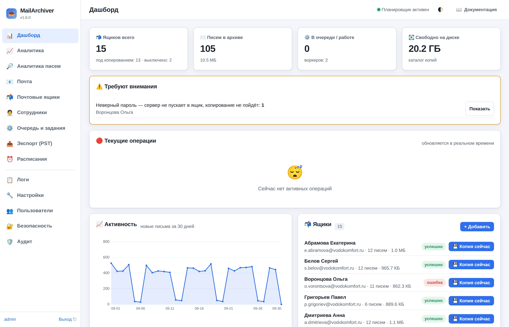

# MailArchiver

**Сервис резервного копирования почтовых ящиков по IMAP с веб-интерфейсом, очередью заданий,
планировщиком, подробной статистикой и экспортом в `.pst` для Microsoft Outlook.**

MailArchiver по расписанию делает локальные копии почтовых ящиков (по IMAP), позволяет выгрузить
эти копии в формат `.pst` (для всех версий Outlook), а также восстановить письма обратно на
IMAP-сервер. Всё управляется через удобный веб-интерфейс с подсказкой к каждому параметру.

---

## Возможности

- 📥 **Инкрементальный бэкап по IMAP** — докачиваются только новые письма (по UID/UIDVALIDITY), с сохранением структуры папок и флагов (прочитано/важное и т.п.). Переезд почты на другой сервер не удваивает архив: уже скачанные письма узнаются по Message-ID, размеру и дате. Письма старше срока хранения ящика не скачиваются.
- 💾 **Надёжное локальное хранилище** в формате Maildir (по файлу `.eml` на письмо) с проверкой целостности (SHA-256) и опциональным сжатием.
- 📤 **Экспорт в `.pst`** (ANSI для Outlook 97–2002, Unicode для Outlook 2003+), а также в **EML** и **MBOX**.
  - Движок **Aspose** — надёжный `.pst` (нужна лицензия для продакшена).
  - Встроенный **native**-движок — бесплатный экспериментальный генератор `.pst` без зависимостей (проверяется утилитой `readpst`): папки, тема, адреса, дата и текст писем, **без вложений**.
- ♻️ **Восстановление** писем из копии обратно на любой IMAP-сервер (с флагами и датами, защитой от дублей, пробным прогоном).
- 📥 **Импорт из `.pst`** — заливка существующего PST-файла на IMAP-сервер.
- ⏰ **Планировщик** (cron/интервалы) — автоматический бэкап по расписанию, в том числе **копирование всех ящиков по очереди**: одно задание в заданное время копирует ящики строго по одному (давно не копировавшиеся — первыми), с паузой между ящиками и остановкой к началу рабочего дня; переживает перезапуск службы.
- 🧰 **Групповые действия** над сотнями ящиков: копирование (параллельно или по очереди), копия «с нуля» с карантином прежних копий, включение/выключение, срок хранения, удержание, расписания с разносом по времени, смена сервера и способа входа, папки и их проверка на сервере, выгрузка, восстановление, переиндексация поиска, удаление — с проверкой по каждому ящику до запуска, подтверждением опасных действий и историей операций. Добавление ящиков списком и список ящиков в Excel.
- 🧺 **Прежние копии после «с нуля»**: автоматическое сравнение с новой копией, список писем, которых в новой нет, возврат их в архив и удаление карантина только без потери писем.
- ⚙️ **Очередь заданий** с приоритетами, лимитом нагрузки на ящик, отменой и повторными попытками.
- 📊 **Живая статистика** и мониторинг текущих операций (WebSocket), графики, логи, история, аудит.
- 👷 **Роль «Оператор»**: следит за копированием и запускает его (копии, проверки, отмена и повтор заданий, журнал), но не читает письма, не меняет настроек и ничего не удаляет — права проверяются на сервере по белому списку.
- 📈 **Аналитика системы** (для администратора и оператора) — хранилище, задания по статусам и типам, длительность заданий, активность по дням, экспорты, расписания.
- 🔎 **Аналитика писем** (для администратора) — отправители и домены, распределение по годам/дням недели/часам, тепловая карта «день недели × час», размеры, вложения, облака частых слов. Плюс **глубокий анализ содержимого** фоновым заданием: типы вложений, домены получателей, текст/HTML, язык. Графики рисуются локально, без внешних библиотек.
- 📬 **Контроль ящиков**: проверка паролей всех ящиков одной кнопкой, даты первой и последней копии в таблице, отборы «с неправильным паролем», «без резервных копий», «копия устарела», история копирования ящика.
- 🧑‍💼 **Сотрудники**: справочник из кадровой выгрузки (CSV/XLSX/XML-таблица, файл или ссылка) с автоматическим заведением ящиков по шаблону и массовой загрузкой паролей.
- 🔒 **Безопасность**: вход по паролю (PBKDF2), **двухфакторный вход** (TOTP: Яндекс Ключ, Google Authenticator и др.) с резервными кодами, защита от подбора, вход сотрудников в свой архив по паролю ящика, шифрование паролей ящиков (Fernet/AES) и **шифрование самих писем на диске** (AES-256-GCM, по желанию), поддержка OAuth2 (Gmail, Microsoft 365), **журнал безопасности** с действующими блокировками и их снятием.
- 🛰️ **Копия архива вне сервера** — ежедневно в сетевую папку, на другой сервер по SSH (rsync) или в S3 (Yandex Object Storage, VK Cloud, MinIO…), со снимками базы, защитой от массового удаления и восстановлением одной командой (`replica-pull`, `restore-snapshot`).
- 📡 **Мониторинг**: метрики `/metrics` для Prometheus и Zabbix, еженедельная сводка на почту — в том числе о прежних копиях после «с нуля» и письмах, которых нет в архиве.
- 🔍 **Поиск по письмам** во всех ящиках (SQLite FTS5): тема, адреса, имена вложений, текст; каждый поиск — в аудите.
- 🗝️ **Вход в ящики через администратора почты** (Dovecot master users, SASL PLAIN с authzid) — без сбора паролей сотрудников.
- 🧳 **Уволенные сотрудники**: последняя копия, выключение копирования и удержание архива на N лет независимо от срока хранения.
- 🧬 **Отчёт «Одинаковые вложения»** — сколько места освободит хранение одной копии рассылок и логотипов (формат хранения не меняется).
- 🌐 **Веб-интерфейс** на русском с тёмной/светлой темой и **подробной подсказкой к каждому параметру** (описание, рекомендация, пример).

## Скриншот



---

## Быстрый старт

### Вариант 1. Docker Compose (проще всего)

```bash
cd docker
docker compose up -d
```
Откройте `http://127.0.0.1:8493` на этой же машине (порт намеренно опубликован только локально;
снаружи — через reverse proxy с HTTPS или SSH-туннель, см. `docs/ru/03-installation.md`).
Администратора создайте при первом входе (мастер первичной настройки).

### Вариант 2. Установка на Linux (служба systemd)

```bash
cd mail_backup
sudo bash scripts/install.sh
```
Скрипт автоматически определит дистрибутив (apt/dnf/yum/zypper/pacman), установит зависимости,
создаст пользователя и службу, настроит автозапуск и предложит создать администратора.
Веб-интерфейс: `http://127.0.0.1:8493`.

**Обновление:**
```bash
cd mail_backup   # новая версия исходников
sudo bash scripts/update.sh
```

**Удаление:**
```bash
sudo bash scripts/uninstall.sh          # данные сохраняются
sudo bash scripts/uninstall.sh --purge  # удалить всё, включая данные
```

---

## Документация

- 📖 **Полная документация со скриншотами и схемами** открывается прямо из веб-интерфейса
  (кнопка «Документация») или по адресу `/static/docs/index.html`.
- 📋 [Справочник всех параметров](docs/ru/05-parameters-reference.md)
- 🔐 [Безопасность и двухфакторный вход](docs/ru/08-security.md) · [Шифрование копии писем](docs/ru/09-encryption.md) · [Почтовые ящики: пароли и даты копий](docs/ru/10-mailboxes.md)
- 🛰️ [Копия вне сервера и восстановление](docs/ru/13-replica.md) · [Мониторинг](docs/ru/14-monitoring.md) · [Поиск по письмам](docs/ru/15-search.md) · [Вход через администратора почты](docs/ru/16-mailadmin.md)
- 🧰 [Групповые действия с ящиками](docs/ru/17-bulk.md) · [Расписания и копирование всех ящиков по очереди](docs/ru/18-schedules.md)
- 📝 [История изменений](CHANGELOG.md)
- Исходные материалы документации — в каталоге [`docs/ru/`](docs/ru/).

## Требования

- Linux, Python **3.10+** (для нативной установки; в Docker уже включён).
- Для импорта `.pst`: пакет `pst-utils` (Debian/Ubuntu) / `libpst` (RHEL) — ставится автоматически.
- Для копии архива на другой сервер по SSH: `rsync` и `openssh-client` — ставятся автоматически.
- Для надёжного экспорта `.pst`: `pip install Aspose.Email-for-Python-via-NET` + лицензия Aspose (опционально).

## Структура проекта

```
mail_backup/
├── mailarchiver/          # исходный код сервиса
│   ├── imap/              # подключение, бэкап, восстановление
│   ├── storage/           # локальное хранилище Maildir
│   ├── export/            # движки экспорта (eml, mbox, pst-aspose, pst-native)
│   ├── queue/             # очередь заданий и воркеры
│   ├── scheduler/         # планировщик
│   ├── replica/           # копия вне сервера (папка, rsync, S3) и снимки базы
│   ├── web/               # веб-интерфейс (FastAPI) + статика/шаблоны
│   ├── search.py          # поиск по письмам (FTS5)
│   ├── monitoring.py      # метрики Prometheus и еженедельная сводка
│   ├── dedup.py           # отчёт «Одинаковые вложения»
│   ├── bulk.py            # групповые действия с ящиками
│   ├── cronutil.py        # cron-выражения (дни недели как в crontab)
│   ├── config.py, database.py, security.py, service.py, ...
├── config/config.example.yaml
├── scripts/               # install.sh, update.sh, uninstall.sh, gen_docs.py
├── systemd/               # unit-файл systemd
├── docker/                # Dockerfile, docker-compose.yml, entrypoint.sh
├── docs/ru/               # документация
├── tests/                 # автотесты (pytest)
└── requirements.txt, pyproject.toml
```

## Разработка и тесты

```bash
python3 -m venv venv && ./venv/bin/pip install -e ".[test]"
./venv/bin/pytest -q
```

## Лицензия

MIT (см. [LICENSE](LICENSE)). Библиотека Aspose.Email — отдельная коммерческая лицензия
(нужна только при использовании движка экспорта Aspose).
