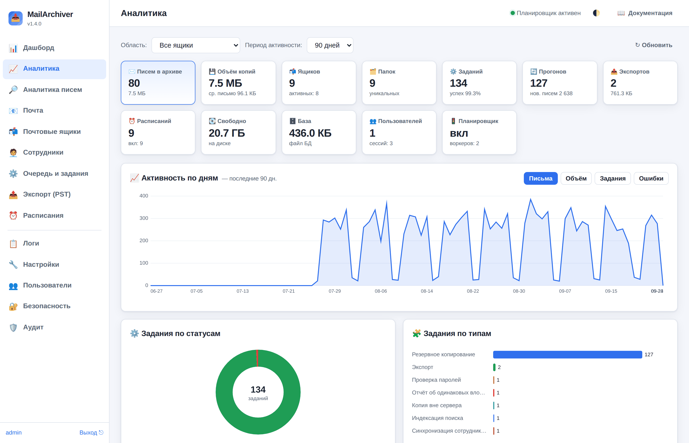
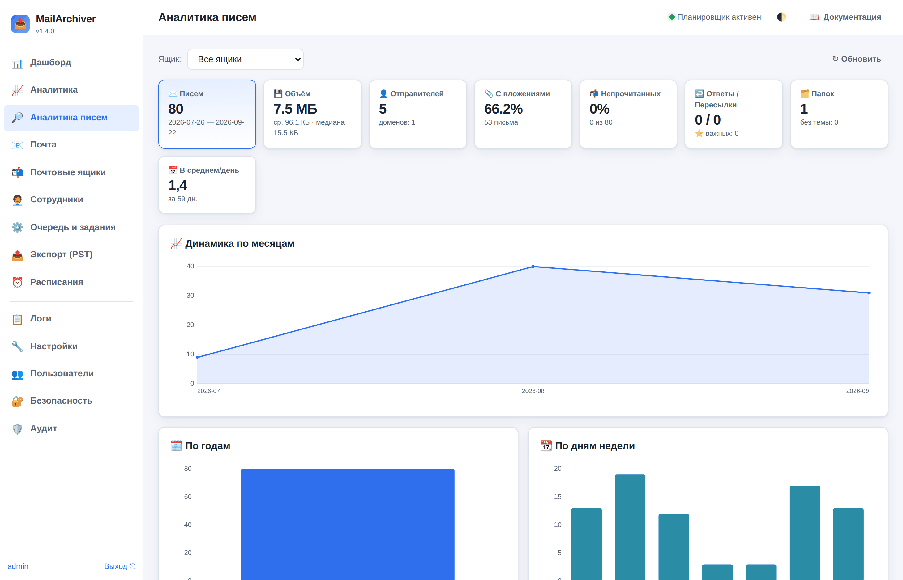
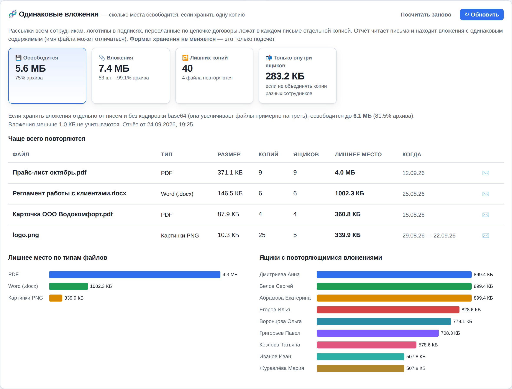

# 6. Аналитика

В интерфейсе администратора есть два раздела аналитики. Оба видны **только администратору** —
пользователь, вошедший по адресу и паролю почтового ящика, их не увидит и к данным не получит
доступа даже напрямую по адресу API.

Все графики рисуются прямо в браузере, без обращения к внешним сервисам: интерфейс полностью
работоспособен в закрытом контуре без доступа в интернет.

---

## 6.1. Раздел «Аналитика» — состояние системы

Отвечает на вопрос «как работает сервис»: сколько хранится, что происходит с заданиями,
не заканчивается ли место.

**Панель управления сверху**

| Элемент | Назначение |
|---------|-----------|
| Область | Все ящики или один конкретный ящик |
| Период активности | Глубина графика активности: 30 дней, 90 дней, полгода, год |
| ↻ Обновить | Пересчитать показатели немедленно |

**Ключевые показатели (плитки)**

Писем в архиве, объём копий и средний размер письма, число ящиков (всего и активных),
количество папок, задания (всего и доля успешных), прогоны копирования и число новых писем,
экспорты и их суммарный объём, расписания (всего и включённых), свободное место на диске,
размер файла базы данных, пользователи и активные сессии, состояние планировщика и число воркеров.

**Графики и таблицы**

- **Активность по дням** — линия с переключателем метрики: письма, объём, задания, ошибки.
  Позволяет увидеть, когда именно рос архив и когда были сбои.
- **Задания по статусам** — кольцевая диаграмма (успешно, ошибка, выполняется, в очереди, отменено).
- **Задания по типам** — сколько было копирований, экспортов, восстановлений, очисток, анализов.
- **Длительность заданий** — среднее и максимальное время выполнения по каждому типу.
  Резкий рост средней длительности бэкапа — повод проверить сеть или почтовый сервер.
- **Экспорт по форматам и движкам** — какими средствами и во что выгружали.
- **Хранилище по ящикам** — таблица (писем, объём, папок, статус последнего прогона) и
  сравнительная диаграмма по числу писем.
- **Ближайшие запуски** — какое расписание сработает следующим и когда.
- **Топ действий (аудит)** — какие операции выполнялись чаще всего.

> **На что смотреть в первую очередь.** Доля успешных заданий заметно ниже 100 %, ненулевые
> ошибки на графике активности и мало свободного места на диске — три показателя, которые
> означают, что с резервным копированием нужно разбираться прямо сейчас.

---

## 6.2. Раздел «Аналитика писем» — содержание почты

Отвечает на вопрос «что лежит в ящике»: кто пишет, когда, насколько объёмные письма,
о чём они. Вверху выбирается ящик (или «Все ящики»).

Раздел состоит из двух частей: **быстрой** (считается по индексу писем мгновенно) и
**глубокой** (читает сами файлы писем, запускается отдельно).

### Быстрая часть — по индексу

Считается по данным, которые уже сохранены при копировании: тема, отправитель, дата, размер,
флаги, папка. Работает мгновенно даже на больших ящиках.

**Показатели:** всего писем и период (от самой ранней до самой поздней даты), объём, средний и
медианный размер, число уникальных отправителей и доменов, доля писем с вложениями, доля
непрочитанных, количество ответов и пересылок, число важных (помеченных флажком), количество
папок, писем без темы, среднее число писем в день.

**Графики:**

- **Динамика по месяцам** — рост переписки во времени.
- **По годам** и **по дням недели** — столбчатые диаграммы.
- **Распределение по часам суток** — когда приходит почта.
- **Тепловая карта «день недели × час»** — чем ярче клетка, тем больше писем пришло в это
  время. Наглядно показывает рабочие часы и активность в выходные.
- **Размеры писем** — гистограмма по диапазонам (от «менее 10 КБ» до «более 10 МБ»).
  Помогает понять, что именно занимает место.
- **Прочитанность и вложения** — две кольцевые диаграммы.
- **Топ отправителей** и **топ доменов** — от кого приходит больше всего писем.
- **Папки** — сколько писем и сколько места в каждой папке.
- **Частые слова в темах** — облако слов; служебные слова и предлоги отбрасываются.
- **Крупнейшие письма** — таблица самых тяжёлых писем с темой, отправителем, папкой и датой.

### Глубокая часть — разбор самих писем

Блок «🔬 Глубокий анализ содержимого» внизу страницы. Он вскрывает каждое письмо (файл `.eml`)
и извлекает то, чего нет в индексе. Это тяжёлая операция, поэтому она вынесена в **фоновое
задание**: нажмите «Запустить анализ» (или «Пересчитать»), а прогресс смотрите в разделе
«Очередь и задания». Результат сохраняется, и при следующем открытии страницы показывается
сразу, с отметкой даты расчёта.

**Что показывает:**

- число вложений, их суммарный объём и в скольких письмах они встречаются;
- **типы вложений** — по расширению (pdf, docx, xlsx, zip…) и по MIME-типу;
- **домены получателей** — кому писали (из полей «Кому» и «Копия»);
- **формат тела** — текст, HTML или и то и другое;
- **язык** — русский, латиница или смешанный (эвристика по символам);
- средняя длина текста письма;
- **частые слова в тексте писем** — облако слов по содержимому, а не только по темам.

> **Сколько это занимает.** Анализ читает каждое письмо с диска. Ориентир — около 3–4 секунд
> на 650 писем; на ящике в 100 тысяч писем это несколько минут. Задание можно отменить в любой
> момент, на резервное копирование оно не влияет.

---

## 6.3. Одинаковые вложения — сколько места сэкономит хранение одной копии

Блок «🧬 Одинаковые вложения» внизу раздела «Аналитика» (область «Все ящики»). В почте много
повторов: прайс, разосланный всем сотрудникам, — это сотни одинаковых PDF; логотип в подписи —
картинка в каждом письме; договор, пересланный по цепочке, — ещё десяток копий. Сейчас каждая
копия хранится внутри своего письма. Отчёт считает, **сколько места освободилось бы, если хранить
каждое одинаковое вложение один раз**, чтобы решить, стоит ли менять формат хранения.
**Формат хранения при этом не меняется** — это только подсчёт.

**Как запустить.** Кнопка «▶ Посчитать» ставит фоновое задание «Отчёт об одинаковых
вложениях». Оно читает письма, раскодирует вложения и сравнивает их **по содержимому** (отпечаток
SHA-256): одинаковыми считаются файлы с одинаковым содержимым, даже если имена разные.
Первый подсчёт читает весь архив — на большом архиве это часы; задание работает частями и
пропускает вперёд копирования ящиков, а отчёт по уже прочитанной части виден сразу (с отметкой
«прочитано N %»). Следующие подсчёты («↻ Обновить») читают **только новые письма**; письма,
удалённые из архива, выпадают из подсчёта сами. «Посчитать заново» забывает прочитанное и
читает всё с начала.

**Что показывает:**

- **Освободится** — главная цифра: место, которое занимают лишние копии, и его доля в архиве;
- **Вложения** — сколько всего места занимают вложения и сколько их;
- **Лишних копий** — сколько повторов и сколько разных файлов повторяется;
- **Только внутри ящиков** — сколько освободилось бы, если объединять копии только в пределах
  одного ящика (обычно намного меньше: основная экономия — на рассылках всем сотрудникам);
- «**Если хранить вложения отдельно от писем и без кодировки base64**» — ещё больше: в письме
  вложение записано в base64, это на треть больше самого файла;
- **Чаще всего повторяются** — таблица: файл (и сколько у него разных имён), тип, размер, число
  копий, в скольких ящиках, лишнее место, период (первое и последнее письмо); кнопка ✉️
  открывает одно из писем с этим вложением в разделе «Почта»;
- **Лишнее место по типам файлов** (PDF, картинки, Excel…) и **ящики с повторяющимися
  вложениями**;
- **Письма-двойники целиком** — одно и то же письмо, лежащее в нескольких папках.

Вложения меньше 1 КБ не учитываются: экономия на них копеечная. При включённом сжатии копии
экономия на диске будет примерно на четверть меньше показанной (об этом есть пометка в отчёте).
Отпечатки вложений хранятся в базе — около 100 байт на вложение (на архиве с 3 млн вложений —
около 300 МБ).

API: `GET /api/analytics/dedup` — отчёт и ход подсчёта, `POST /api/analytics/dedup/scan`
(`{"full": true}` — заново).

---

## 6.4. Ответы на типичные вопросы

**Влияет ли аналитика на письма?** Нет. Оба раздела только читают данные. Ни на сервере,
ни в локальных копиях ничего не изменяется и не удаляется.

**Почему цифры в «Аналитике» и «Аналитике писем» различаются?** «Аналитика» показывает
состояние системы целиком (включая служебные задания и экспорты), «Аналитика писем» — только
содержимое выбранного ящика.

**Почему пусто?** Аналитика строится по локальным копиям. Пока не выполнено ни одного
резервного копирования, показывать нечего — сделайте бэкап ящика.

**Можно ли выгрузить эти данные?** Отдельной кнопки выгрузки нет, но всё доступно через API
(`/api/analytics/system`, `/api/analytics/mail`, `/api/analytics/mail/deep`) — ответы в формате
JSON, права администратора обязательны.

**Долго ли считается «Аналитика писем» на большом архиве?** Расчёт обходит весь индекс писем.
Замер на 200 000 писем: около 4 секунд и ~115 МБ памяти; на миллион — порядка 20 секунд.
Готовый результат кэшируется на 5 минут, поэтому повторные открытия вкладки отвечают мгновенно.
Кэш сбрасывается автоматически, когда число писем меняется: после копирования, очистки по
ретеншну или пересоздания копии. Принудительный пересчёт — кнопка «↻ Обновить»
(в API: `GET /api/analytics/mail?refresh=1`).

Одновременно выполняется не больше двух расчётов: если открыть вкладку в нескольких окнах сразу,
третий запрос подождёт освободившегося места, а не заберёт ещё один поток и ещё сотню мегабайт.
