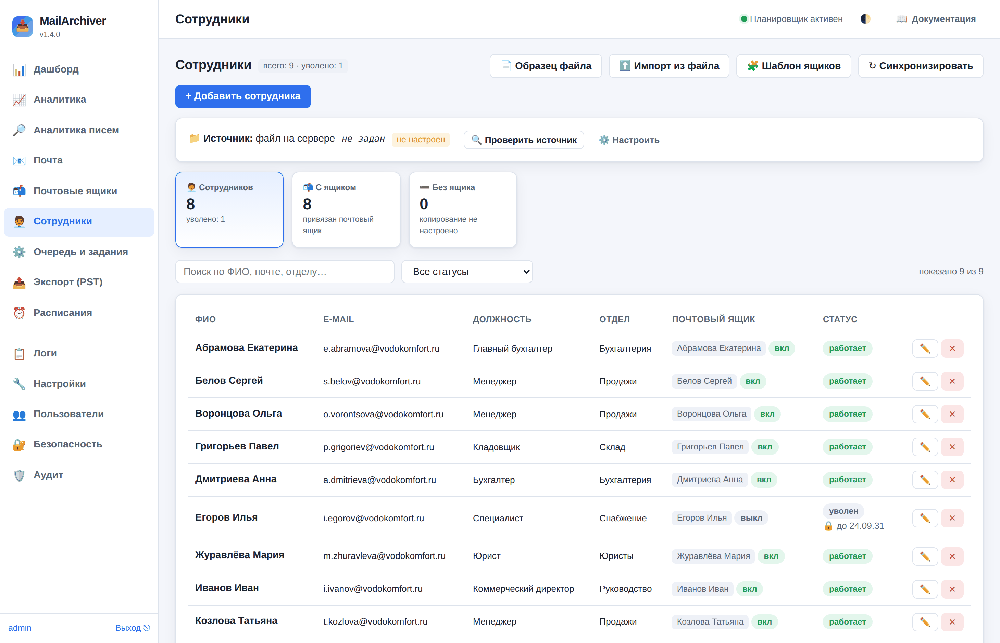
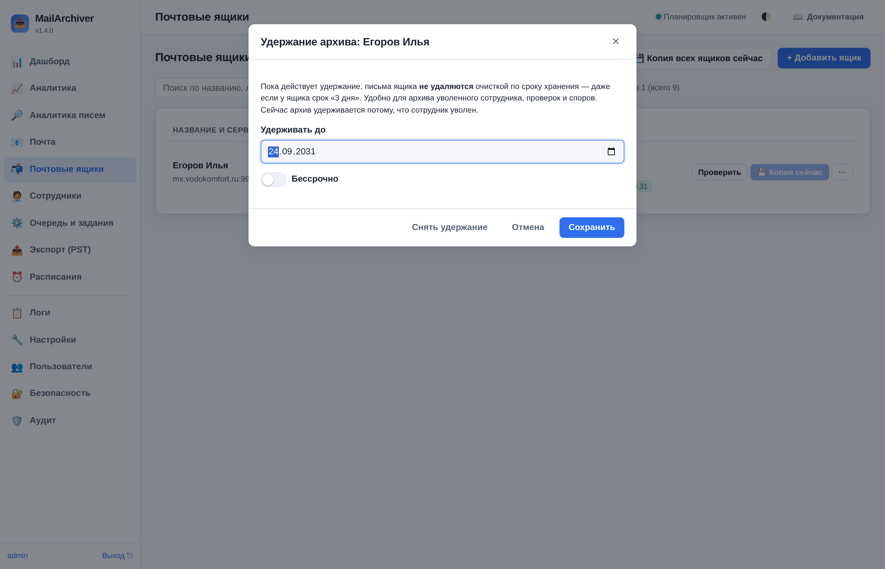

# 7. Сотрудники

Раздел **«Сотрудники»** — справочник людей организации и связь каждого из них с почтовым ящиком,
который копирует сервис. Раздел виден **только администратору**.

Зачем он нужен: в разделе «Почтовые ящики» видны технические записи (адрес, сервер, логин), и по ним
не всегда понятно, чья это почта. Справочник сотрудников добавляет человеческий слой — ФИО, должность,
отдел — и позволяет завести ящики сразу на весь список из кадровой выгрузки, а не по одному вручную.

---

## 7.1. Что можно делать

| Действие | Как |
|----------|-----|
| Добавить сотрудника | «+ Добавить сотрудника», заполнить карточку |
| Изменить | ✏️ в строке сотрудника |
| Удалить | ✕ в строке. **Почтовый ящик и уже сделанные копии писем при этом не удаляются** |
| Загрузить список из файла | «⬆️ Импорт из файла» — разовая загрузка CSV или Excel |
| Синхронизировать | «↻ Синхронизировать» — прочитать источник, указанный в настройках (файл или URL) |
| Проверить источник | «🔍 Проверить источник» на плашке — читает источник и показывает, сколько строк в нём нашлось, **ничего не меняя** |
| Посмотреть шаблон ящиков | «🧩 Шаблон ящиков» — как будет выглядеть ящик, созданный сотруднику автоматически |
| Скачать образец | «📄 Образец файла» — готовый CSV с нужными заголовками |

Сверху показаны три счётчика: сколько сотрудников активно, у скольких привязан почтовый ящик и у
скольких ящика нет (то есть их почта не копируется). Под заголовком — плашка источника: откуда
берётся список (файл или адрес), включено ли расписание, и кнопки «Проверить источник» и
«Настроить». Ниже — поиск по ФИО, почте и отделу и фильтр по статусу.

---

## 7.2. Карточка сотрудника

ФИО (обязательно), e-mail, табельный номер, должность, отдел, телефон, статус («Работает» или
«Уволен (архив удерживается)» — см. 7.8) и заметки.

Два поля важны для связи с почтой:

- **E-mail** — по нему сотрудник связывается с почтовым ящиком. Если при создании включить галочку
  «Завести почтовый ящик», сервис создаст ящик с этим адресом в качестве логина.
- **Табельный номер** — по нему сотрудник опознаётся при повторной синхронизации. Если номер есть,
  смена фамилии или адреса почты не создаст дубликат карточки.

> **Созданные ящики без пароля.** Сервис не знает паролей от почты сотрудников, поэтому копирование
> по новому ящику не идёт, пока администратор не откроет «Почтовые ящики», не задаст пароль и не
> включит ящик. Остальные настройки нового ящика — название, логин, папки, расписание — берутся из
> шаблона (см. 7.6); по умолчанию ящик создаётся ещё и выключенным.

---

## 7.3. Файл со списком

Подходят **CSV** и **Excel (.xlsx)**. Первая строка — заголовки столбцов. Порядок столбцов любой,
лишние столбцы игнорируются. Названия распознаются без учёта регистра:

| Что | Подходящие названия столбца |
|-----|------------------------------|
| ФИО | ФИО, Ф.И.О., Имя, Сотрудник, Фамилия Имя Отчество, full_name, name |
| Почта | E-mail, Email, Почта, Электронная почта, Адрес электронной почты, Корпоративная почта, mail — а также любой заголовок со словами «mail» или «почт» |
| Должность | Должность, position, title |
| Отдел | Отдел, Подразделение, department |
| Телефон | Телефон, Тел, phone |
| Табельный номер | Табельный номер, Табельный, ID, Код, external_id |

Пример (точка с запятой — привычный для Excel разделитель, запятая и табуляция тоже понимаются):

```
Табельный номер;ФИО;E-mail;Должность;Отдел;Телефон
1024;Иванов Иван Иванович;ivanov@example.ru;Менеджер;Продажи;+7 900 111-22-33
```

Кодировка файла определяется автоматически (UTF-8, Windows-1251 и «Юникод-текст» Excel — UTF-16),
разделитель — по первым строкам файла (при равенстве предпочитается «;»).

Что ещё понимается:

- **Колонка почты с незнакомым заголовком** находится по содержимому — если в ней в основном адреса.
  Колонка «Адрес» (обычно это почтовый адрес) почтой не считается, если в ней не адреса почты.
  Если колонку почты найти не удалось, в отчёте об этом прямо сказано: карточки заведутся без
  адресов, а ящики — нет.
- **Название отчёта над шапкой** («Список сотрудников на 01.09.2026») пропускается: строкой
  заголовков считается первая из верхних строк, где есть ФИО или почта.
- **Признак «работает»** проверяется по всей колонке, а не по первым строкам: «нет» в самом конце
  длинного списка тоже учитывается. Колонка «Уволен» со значениями «да/нет» тоже понимается;
  колонка с датой увольнения («Работает до», «Дата увольнения») учитывается, только если явной
  колонки «работает да/нет» в файле нет.

### XML-таблица (выгрузка из интранета)

Кроме CSV и XLSX читается **«Таблица XML 2003»** (SpreadsheetML) — в таком виде выгружают списки
многие корпоративные системы и интранет-справочники. Формат распознаётся **по содержимому**, поэтому
неважно, как называется файл и что отдаёт сервер по ссылке — `.xls`, `.xml` или вовсе без расширения.

В таких выгрузках разбираются особенности, которых не бывает в обычном CSV:

| Особенность | Как обрабатывается |
|-------------|--------------------|
| ФИО тремя колонками: «фамилия», «имя», «отчество» | Склеивается в одно ФИО. Колонка «имя» рядом с «фамилией» считается именем, а не ФИО целиком |
| Колонка без заголовка со значениями «да»/«нет» | Признак «работает»: строки со значением «нет» в справочник не добавляются и ящик им не заводится |
| Пустой заголовок сразу после «имени» | Отчество |
| Несколько телефонов («рабочий», «внутренний», «мобильный») | В карточку идёт мобильный, при его отсутствии — рабочий, затем внутренний |
| HTML внутри ячейки («Отдел &lt;span&gt;(ЧЛБ)&lt;/span&gt;»), в том числе экранированный | Разметка убирается, остаётся текст; текст вида «&lt;2 кат.&gt;» сохраняется |
| Ячейки с форматированием Excel (`<ss:Data … xmlns=html>`), теги с префиксом `ss:` | Читаются как обычные |
| Объединённые ячейки (`ss:MergeAcross`) | Учитываются — колонки правее не съезжают |
| Файл невалиден как XML (префикс `ss:` без объявления, незакрытые `<br>`) | Читается всё равно — разбор устойчив к такой разметке |
| Файл оборвался (нет закрывающего `</Table>`) | **Отвергается целиком**: обрезанная строка («…@company.r») завела бы чужой ящик |

Если один адрес встречается у нескольких сотрудников (общий ящик склада, сервиса и т. п.), карточка
заводится одна, а в итоге синхронизации сообщается, сколько адресов повторяется и какие именно.

После загрузки показывается отчёт: сколько карточек добавлено, сколько обновлено, сколько ящиков
создано и привязано, а также список строк, которые не удалось разобрать, с номером строки и причиной.

---

## 7.4. Откуда берётся список: файл или URL

Источник выбирается настройкой **«Источник списка»** в «Настройки» → раздел «Сотрудники».

### Файл на сервере

Служба читает CSV/XLSX по пути на диске, например `/var/lib/mailarchiver/hr/employees.csv`.
Подходит, когда кадровая система (или скрипт выгрузки) кладёт файл на тот же сервер или на
смонтированную сетевую папку. Файл читает служба `mailarchiver`, поэтому у неё должны быть права
на чтение — проверить это удобнее всего кнопкой «🔍 Проверить источник».

### Адрес (URL)

Служба сама скачивает выгрузку по ссылке `http://` или `https://` перед каждой синхронизацией.
Копировать файл на сервер архива не нужно — достаточно, чтобы кадровая система отдавала его по
ссылке.

| Параметр | Что делает |
|----------|-----------|
| Адрес выгрузки (URL) | Ссылка на файл, например `https://hr.example.ru/export/employees.csv` |
| Логин / Пароль источника | HTTP Basic, если выгрузка закрыта паролем. Пароль хранится в базе зашифрованным и в интерфейс не возвращается |
| Проверять сертификат источника | Выключайте только для внутреннего сервера с самоподписанным сертификатом |
| Таймаут загрузки | Сколько ждать ответа; увеличьте, если выгрузка формируется в момент запроса |
| Формат ответа | «Определять автоматически» (по заголовку `Content-Disposition`, расширению в ссылке и содержимому), либо явно CSV или XLSX |

Что сервис проверяет сам:

- **HTML вместо файла.** Если по ссылке вернулась страница входа, синхронизация так и скажет, а не
  будет жаловаться на отсутствующие столбцы.
- **Ответ 401/403** — в подсказке будет написано, что нужно заполнить логин и пароль источника.
- **Размер.** Больше 20 МБ не скачивается: по такой ссылке обычно оказывается не выгрузка, а архив
  или дамп базы.
- **Формат.** XLSX опознаётся по содержимому, даже если в ссылке нет расширения.
- **Полнота.** Выгрузка должна скачаться целиком за «Таймаут загрузки»; если соединение оборвалось
  или пришло меньше данных, чем обещал сервер, синхронизация отказывается от частичного списка.
- **Переадресация** допускается только на `http(s)://` и не больше 5 раз; логин и пароль источника
  на другой сервер не передаются.

> Пароль и адрес источника доступны только администратору. Проверять ссылку удобно кнопкой
> «🔍 Проверить источник»: она читает источник и показывает число строк, ничего не записывая в
> справочник.

---

## 7.5. Автоматическая синхронизация

Настраивается там же, в «Настройки» → раздел **«Сотрудники»**:

| Параметр | Что делает |
|----------|-----------|
| Синхронизация по расписанию | Включает работу по расписанию |
| Когда синхронизировать | Cron-выражение, по умолчанию `0 5 * * *` — каждый день в 05:00 |
| Заводить ящики новым сотрудникам | Создавать ли ящики (см. шаблон ниже) |

Как работает синхронизация:

1. Сотрудник опознаётся сначала по табельному номеру, затем по адресу почты, затем — по ФИО среди
   карточек без номера и почты (такой карточке дозаполняются почта и номер, а не заводится вторая;
   однофамильцы в одном файле не склеиваются).
2. Новые добавляются, у существующих обновляются заполненные поля. **Пустые значения в файле ничего
   не затирают** — если в выгрузке нет телефона, ранее введённый вручную телефон сохранится.
3. Новым сотрудникам при необходимости заводятся ящики — по шаблону из настроек (см. 7.6). Для
   этого в шаблоне должен быть указан **IMAP-сервер**: пока его нет, ящики не заводятся (уже
   существующие по-прежнему привязываются), а в итоге синхронизации есть предупреждение.
   **Ящик, который администратор удалил или отвязал**, заново не создаётся.
4. **Сотрудники, исчезнувшие из файла, не трогаются**: ничего не выключается, не архивируется и не
   удаляется. Уволенных администратор обрабатывает вручную — это защита от того, чтобы сбой выгрузки
   или случайно урезанный файл не остановили копирование почты у половины организации.

Синхронизация выполняется как обычное фоновое задание, поэтому её ход и результат видны в разделе
«Очередь и задания» вместе с остальными операциями. Синхронизации идут строго по одной: повторное
нажатие кнопки, пока идёт прежняя, новую не ставит, а загрузка файла из интерфейса во время
синхронизации по расписанию сразу отвечает «уже идёт синхронизация» — дубли карточек и ящиков
от одновременных прогонов исключены.

---

## 7.6. Шаблон настроек создаваемых ящиков

Когда сервис заводит ящик сотруднику — при синхронизации или при добавлении карточки вручную с
галочкой «Завести почтовый ящик» — он берёт настройки из **шаблона**. Шаблон живёт в «Настройки» →
«Сотрудники»; посмотреть результат, не заводя ящиков, можно кнопкой «🧩 Шаблон ящиков» в разделе
«Сотрудники».

| Параметр шаблона | Что задаёт |
|------------------|-----------|
| IMAP-сервер, порт, шифрование | Подключение создаваемого ящика |
| Название ящика (шаблон) | Как ящик называется в списке, например `{full_name} ({department})` |
| Логин ящика (шаблон) | Имя пользователя на сервере. По умолчанию `{email}`; если входят коротким именем — `{local}` |
| Заметка в карточке (шаблон) | Текст в поле «Заметки», например `Создан автоматически: {position}, {department}` |
| Включать созданные ящики | Включать ящик сразу или оставлять выключенным до ввода пароля |
| Копировать только папки / Пропускать папки | Фильтры папок для нового ящика, например пропускать «Спам, Корзина» |
| Срок хранения новых ящиков | `-1` — как в общих настройках, `0` — хранить вечно, `N` — N дней |
| Заводить расписание копирования | Создавать новому ящику расписание, чтобы его почта копировалась без ручной настройки |
| Расписание новых ящиков | Cron-выражение этого расписания, по умолчанию `0 2 * * *` |

Подстановки, доступные в шаблонах названия, логина и заметки:

| Подстановка | Значение |
|-------------|----------|
| `{full_name}` | ФИО целиком |
| `{last_name}`, `{first_name}` | Первое и второе слово ФИО |
| `{email}` | Адрес почты |
| `{local}`, `{domain}` | Части адреса до и после `@` |
| `{position}`, `{department}` | Должность и отдел |
| `{external_id}` | Табельный номер |

Пустые значения подставляются как пустая строка, а оставшиеся от них скобки и лишние пробелы
убираются: шаблон `{full_name} ({department})` для сотрудника без отдела даст просто ФИО.

> **Пароль шаблон не задаёт никогда.** Сервис не знает паролей от почты сотрудников. Даже ящик,
> созданный «включённым», не начнёт копирование, пока администратор не впишет пароль в разделе
> «Почтовые ящики».

---

## 7.7. Пароли ящиков из файла

Ящики, заведённые сотрудникам автоматически, создаются **без пароля** — сервис не знает паролей от
почты. Чтобы не открывать сотни карточек по одной, пароли загружаются пачкой:
«Почтовые ящики» → **«🔑 Загрузить пароли»**.

Файл — **XLSX**, **CSV** или XML-таблица: адрес ящика и пароль. С заголовками «email» и «пароль»
(или «логин» и «пароль») в файле могут быть и другие колонки, а вместо адреса — логин без домена.
Без заголовков колонок должно быть **ровно две**: если их больше, файл отклоняется — иначе паролем
могло бы стать ФИО. Если первая строка уже похожа на пару «адрес — пароль», она читается как данные.

Ячейки, которые Excel сам превратил в другой тип, не применяются: пароль, ставший датой,
«TRUE/FALSE» или дробным числом, пропускается с причиной в отчёте (отформатируйте колонку паролей
как текст). Пароль из одних цифр принимается.

```
email;пароль
ivanov@company.ru;пароль1
petrova@company.ru;пароль2
```

- Ящик ищется по логину, а если такого логина нет — по адресу сотрудника из справочника
  (в интранете логин и адрес иногда различаются).
- Галочка **«Включить ящики после установки пароля»** сразу включает те, что были выключены.
- В отчёте видно: сколько ящиков обновлено, сколько включено, для каких адресов ящик не нашёлся и
  какие строки файла не разобраны (пустой пароль, неверный адрес, повторяющийся адрес).

> **Что происходит с паролями.** Они сохраняются в базе в зашифрованном виде, в журнал и обратно в
> интерфейс не попадают, а загруженный файл удаляется с сервера сразу после разбора — и при успехе,
> и при ошибке. В аудит пишутся только счётчики и имя файла.

---

## 7.8. Уволенные сотрудники

Когда сотрудник увольняется, его ящик на почтовом сервере обычно удаляют — а переписка может
понадобиться через годы (споры с клиентами, проверки, передача дел). MailArchiver делает для
уволенного три вещи:

1. **Последняя копия.** Сразу ставит копирование ящика в очередь с высоким приоритетом — пока
   ящик ещё есть на сервере.
2. **Выключение.** После этой копии (удачной или нет) копирование ящика выключается: ящика на
   сервере скоро не будет, и ежедневные ошибки «неверный пароль» никому не нужны.
3. **Удержание архива.** Письма ящика **не удаляются по сроку хранения** — даже если у ящика
   срок «3 дня» — в течение `dismissed_keep_years` лет (по умолчанию 5; 0 — бессрочно).
   Удалить такой архив нельзя ни очисткой, ни кнопкой «Удалить ящик вместе с архивом».



### Как сотрудник становится уволенным

- **Вручную:** в карточке сотрудника статус «Уволен (архив удерживается)».
- **По кадровой выгрузке** (параметр «Отмечать уволенных по выгрузке», включён по умолчанию):
  сотрудник, уже заведённый в справочнике, помечен в выгрузке как не работающий — колонка
  «Работает: нет», «Уволен: да» или прошедшая «Дата увольнения».
- **По отсутствию в выгрузке** (параметр «Уволен, если нет в выгрузке, дней», по умолчанию
  выключен): подходит, если выгрузка содержит только работающих. Сотрудник, которого нет в
  выгрузке N дней подряд, считается уволенным. Карточки, заведённые вручную, так не
  увольняются.

**Защита от испорченной выгрузки.** Если одна синхронизация отмечает уволенными больше 20 %
работающих сотрудников (а в небольшом справочнике — больше 5 человек), это похоже не на
увольнения, а на сломанный файл (обрезанный, не та вкладка, пустая колонка «Работает»). Такие
увольнения **не применяются**, а в итоге синхронизации появляется предупреждение — проверьте
выгрузку. Если увольнения настоящие, отметьте сотрудников вручную или временно выключите
«Отмечать уволенных по выгрузке».

### Что можно настроить

| Параметр («Настройки → Сотрудники») | Что задаёт |
|--------------------------------------|-----------|
| Отмечать уволенных по выгрузке | Увольнять по колонкам «Работает» / «Уволен» / «Дата увольнения» |
| Уволен, если нет в выгрузке, дней | Увольнять пропавших из выгрузки через N дней (0 — нет) |
| Что делать с ящиком уволенного | «Последняя копия и выключить» (по умолчанию) или «Продолжать копировать» |
| Хранить архив уволенного, лет | Сколько лет удерживать архив (0 — бессрочно) |

### Если сотрудник вернулся

Снова отметьте его «Работает» — вручную или новой выгрузкой. Копирование ящика включится обратно,
удержание, поставленное из-за увольнения, снимется. Удержание, заданное вручную на более долгий
срок, сохраняется.

### Удержание вручную и удаление архива



В меню ящика («Почтовые ящики» → ⋯) есть **«🔒 Удержание архива»**: удерживать до даты или
бессрочно — например, на время проверки или судебного спора, для любого ящика, не только
уволенного. Там же — снять удержание.

Когда удержание истекло, ящик попадает в отбор **«Удержание истекло»** в разделе «Почтовые ящики».
Сам архив автоматически не удаляется: решение за администратором. Удалить ящик вместе со всеми
файлами писем — пункт меню **«🧹 Удалить ящик вместе с архивом писем»** (нужно ввести название
ящика для подтверждения; пока действует удержание, пункт недоступен). Обычное «Удалить ящик»
удаляет только запись, файлы писем остаются на диске.

В разделе «Почтовые ящики» есть отборы «Уволенные сотрудники», «Архив удерживается» и
«Удержание истекло»; в разделе «Сотрудники» у уволенного видно, до какой даты удерживается архив.

---

## 7.9. Частые вопросы

**Удалил сотрудника — что стало с его почтой?** Ничего. Удаляется только карточка из справочника.
Почтовый ящик остаётся в разделе «Почтовые ящики», локальные копии писем — на диске.

**Удалил ящик сотрудника — не появится ли он снова ночью?** Нет. Синхронизация заводит ящик только
сотруднику, у которого ящика ещё не было. Чтобы вернуть ящик, привяжите его в карточке сотрудника.

**Почему созданный ящик не копируется?** Он создан выключенным и без пароля. Задайте пароль и
включите его в разделе «Почтовые ящики».

**Что будет, если загрузить тот же файл дважды?** Ничего лишнего: карточки не задвоятся, они будут
опознаны по табельному номеру или адресу почты и просто обновятся.

**В выгрузке один адрес у нескольких человек.** Так бывает с общими ящиками (склад, сервис).
Карточка заводится одна — на адрес; в итоге синхронизации видно, сколько строк совпало по адресу.

**Можно ли вести справочник вручную, без файла?** Да. Автоматическая синхронизация по умолчанию
выключена, а создавать, изменять и удалять сотрудников можно кнопками в разделе.

**По ссылке приходит «страница входа».** Источник закрыт авторизацией: заполните «Логин источника»
и «Пароль источника». Если там не HTTP Basic, а вход по форме или токену, попросите у кадровой
системы прямую ссылку с ключом в адресе.

**Ящики создаются, но почта не копируется.** Либо у ящика не задан пароль, либо ему не создано
расписание. В шаблоне включите «Заводить расписание копирования» — тогда новые ящики сразу попадут
в ночное копирование.
