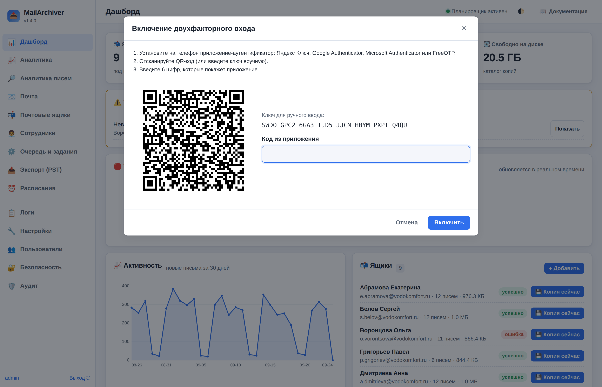
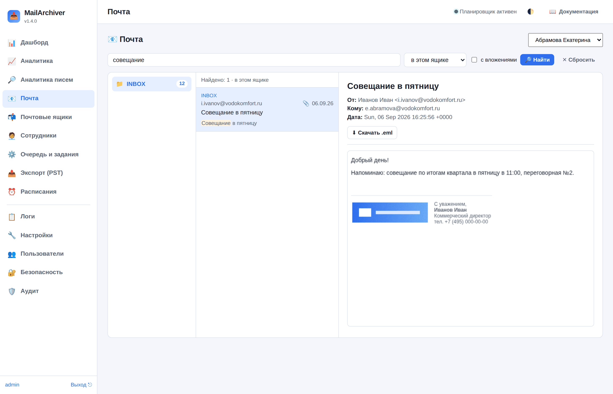
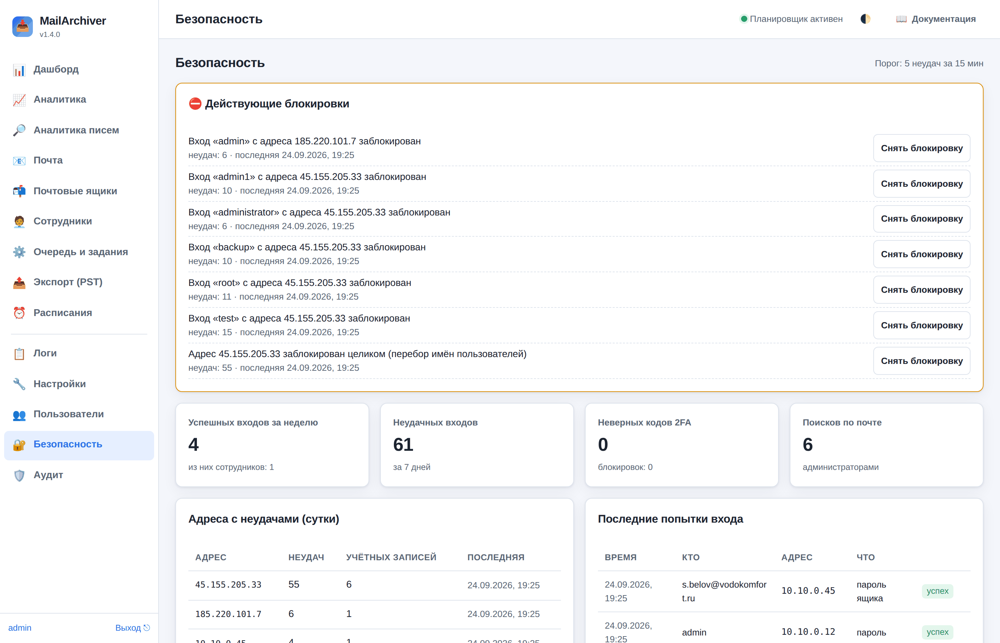

# Безопасность: вход, двухфакторная аутентификация, доступ сотрудников

В MailArchiver хранится почта всей организации, поэтому вход в интерфейс защищён
в несколько слоёв. Здесь описано, как они работают и что настроить.

## 1. Вход администратора

- Пароли пользователей хранятся только в виде хеша (PBKDF2), восстановить пароль
  из базы нельзя. Забытый пароль сбрасывается командой на сервере:
  `sudo mailarchiver reset-password -u admin`.
- **Сеанс** живёт `security.session_ttl_hours` часов (по умолчанию 12) и
  завершается раньше, если пользователь ничего не делал `security.session_idle_minutes`
  минут (по умолчанию 60). Открытая, но забытая вкладка сеанс **не продлевает**:
  живое обновление дашборда и опрос хода заданий идут «в фоне» и не считаются
  действиями пользователя. Когда сеанс закончился, интерфейс сам показывает форму
  входа и после входа возвращает в тот же раздел.
- Смена пароля (своего или чужого) завершает все открытые сеансы этого
  пользователя; «Пользователи» → «Завершить сеансы» делает то же без смены пароля.

## 2. Защита от подбора пароля

Счёт неудачных попыток ведётся так, чтобы злоумышленник не мог «выключить» вход
настоящему владельцу учётной записи:

| Что считается | Предел (при `max_login_attempts = 5`) | Что происходит |
|---|---|---|
| Учётная запись + один адрес | 5 за `lockout_minutes` | этот адрес блокируется для этой учётной записи |
| Один адрес по всем учётным записям | 50 | адрес блокируется целиком (перебор имён) |
| Учётная запись со всех адресов | 100 | вход не блокируется, но ответ на неудачу замедляется (до 2 с) |
| Неверные коды 2FA учётной записи | 10 за `lockout_minutes`, 50 за сутки | ввод кодов из приложения блокируется, резервные коды работают |
| Проверки пароля одного почтового ящика | 10 | пароль этого ящика на почтовом сервере не проверяется до конца окна |
| Проверки паролей всех ящиков вместе | 60 | вход по паролю ящика временно приостановлен |

Все пределы считаются от одного параметра `security.max_login_attempts`, окно —
`security.lockout_minutes`.

## 3. Двухфакторный вход (2FA)

После пароля запрашивается шестизначный код из приложения-аутентификатора на
телефоне: Яндекс Ключ, Google Authenticator, Microsoft Authenticator, FreeOTP,
KeePassXC. Даже если пароль утёк, без телефона войти нельзя.

### Как включить

1. Нажмите своё имя внизу меню слева → «Включить двухфакторный вход».
2. Отсканируйте QR-код приложением (или введите ключ вручную).
3. Введите шесть цифр, которые показывает приложение.
4. **Сохраните резервные коды** (10 штук, вида `abcde-fghjk`) — скопируйте в
   менеджер паролей или распечатайте и уберите в сейф. Каждый код подходит для
   входа один раз, если телефона нет под рукой. Больше они показаны не будут;
   новые можно выпустить в том же окне («Новые резервные коды», нужен код из
   приложения).

Чтобы 2FA была **обязательной** для всех администраторов, включите
«Настройки → Безопасность → Обязательный двухфакторный вход» (`security.require_2fa`).
Администратор без 2FA после входа увидит только окно её настройки.

### Как это защищено

- Код из приложения действует 30 секунд (принимается соседний шаг — если часы
  телефона немного расходятся с сервером). Один и тот же код дважды не принимается.
- После верного пароля выдаётся одноразовый «билет» на 5 минут: на него даётся
  **3 попытки** ввода кода, затем нужно снова ввести пароль. Билет привязан к
  адресу и к паролю — после смены пароля выданные билеты перестают действовать.
- Неверные коды учитываются по учётной записи **со всех адресов**: после 10
  неудач за 15 минут (или 50 за сутки) ввод кодов из приложения блокируется, а
  администраторам уходит письмо-уведомление (если уведомления настроены). Это
  значит, что пароль учётной записи, по всей видимости, известен постороннему —
  **смените его**. Резервные коды при этом продолжают работать: подобрать их
  невозможно (около 50 бит на код), и владелец войдёт даже во время атаки.
- Резервные коды хранятся как хеши и не зависят от файла `secret.key`. Если этот
  файл потерян или заменён (коды из приложения тогда проверить нельзя), войдите
  резервным кодом.

### Потерян телефон

- Войдите резервным кодом, затем отключите 2FA и включите заново с новым телефоном.
- Нет ни телефона, ни кодов — другой администратор: «Пользователи» → «Сбросить 2FA».
- Единственный администратор — на сервере: `sudo mailarchiver reset-2fa -u admin`.

## 4. Вход сотрудников по паролю своего ящика

Сотрудник может войти в интерфейс своим email и паролем почтового ящика и
работать **только со своим архивом**: читать письма, скачивать их и вложения,
выгружать и восстанавливать свой ящик (раздел «Почта» → «Выгрузить» /
«Восстановить в ящик»), следить за своими заданиями.

Чего сотрудник **не может**: менять срок хранения и расписания (то есть
уменьшить или отключить архив), отменять копирование по расписанию, загружать
.pst, видеть чужие ящики, общий журнал, логины администраторов и заметки к ящику.
Ограничения от перегрузки: одно такое же задание по ящику за раз, не больше 20
заданий в час и не больше 3 хранящихся выгрузок.

Пароль сотрудника проверяется входом на почтовый сервер. Чтобы страницу входа
нельзя было использовать для подбора паролей почты (и чтобы защита почтового
сервера, например fail2ban, не заблокировала адрес MailArchiver — тогда
остановилось бы копирование всех ящиков), число таких проверок ограничено
(см. таблицу выше). Если сотрудникам этот вход не нужен, выключите его:
«Настройки → Безопасность → Вход сотрудников по паролю ящика» (`security.mailbox_login`).

Сеансы сотрудника завершаются, когда администратор задаёт ящику новый пароль,
выключает ящик или нажимает в меню ящика «Завершить сеансы сотрудника».

## 5. Защита веб-интерфейса

- Запросы, меняющие данные, принимаются только со «своей» страницы (проверка
  `Origin`/`Referer` или служебного заголовка) — чужой сайт не может отправить
  их от имени вошедшего администратора. Интерфейс нельзя встроить в чужую страницу.
- **Первичная настройка** (создание первого администратора) и работа в режиме
  без входа (`security.auth_enabled: false`) доступны только по IP-адресу,
  `localhost`, короткому имени без точки или имени из `server.public_url` — это
  защита от атаки DNS rebinding. Если за обратным прокси интерфейс открывается по
  доменному имени, укажите его в `server.public_url`.
- HTML писем показывается в изолированной «песочнице» без скриптов, с
  собственной политикой безопасности: внешние картинки, стили и шрифты
  (трекинг-пиксели) не загружаются, пока вы не нажмёте «Показать картинки».
  Картинки, вложенные в само письмо (логотип в подписи, скриншот в тексте —
  ссылки `cid:`), показываются сразу: они берутся из архива, а не из интернета.
  Встраиваются только растровые картинки (PNG, JPEG, GIF, WebP, BMP) до 5 МБ
  каждая и до 15 МБ на письмо; SVG не встраивается (в нём может быть скрипт).
  Ссылки открываются в новой вкладке.
- Номер версии анонимным посетителям не показывается (ни на странице входа, ни в
  `/health`, ни в документации).

## 6. Раздел «Безопасность»: блокировки и события

Раздел **«🔐 Безопасность»** (только администратору) собирает в одном месте всё, что относится к
входу в интерфейс:

- **Действующие блокировки** — по тем же правилам, что в таблице раздела 2: «вход такого-то
  пользователя с такого-то адреса», «адрес заблокирован целиком (перебор имён)», «ввод кодов 2FA
  заблокирован», «проверка пароля ящика на почтовом сервере приостановлена». У каждой — число
  неудач, время последней и кнопка **«Снять блокировку»**: например, когда сотрудник сам перепутал
  пароль, а ждать 15 минут некогда. Снятие записывается в аудит (`security_unblock`).
- **Адреса с неудачами за сутки** — откуда подбирают пароли и по скольким учётным записям.
- **Последние попытки входа** — кто, откуда, каким способом (пароль, код 2FA, пароль ящика),
  успех или неудача. Журнал попыток хранится около суток.
- **События безопасности** за последнее время: входы и выходы, включение и сброс 2FA, смена
  паролей, завершение сеансов, создание и удаление пользователей, **поиск по почте** (кто что
  искал — см. [поиск](15-search.md)).

Письмо о подборе кода 2FA («пароль этой учётной записи, по-видимому, известен постороннему»)
уходит администраторам не чаще раза за окно блокировки — и после перезапуска службы не
повторяется.

## 7. Метрики мониторинга

Адрес `/metrics` (для Prometheus и Zabbix) по умолчанию **выключен**. Включённый, он отдаётся
только с адресов из списка (по умолчанию — с самого сервера) или по токену в заголовке
`Authorization: Bearer …`: в метриках есть названия ящиков и адреса почты. Подробно —
[мониторинг](14-monitoring.md).

## 8. Секреты на сервере

| Файл | Что защищает | Что будет без него |
|---|---|---|
| `<каталог данных>/secret.key` | пароли ящиков, SMTP и источника сотрудников в базе, подпись cookie, секреты 2FA | пароли ящиков придётся ввести заново, 2FA — сбросить; письма не пострадают |
| ключ шифрования копии (`storage.encryption_key_file`) | содержимое писем на диске и снимков базы (если включено шифрование) | **зашифрованные письма и снимки не прочитать** — см. [шифрование копии](09-encryption.md) |
| `<каталог данных>/replica_ssh_key` | вход на сервер копии по SSH (если копия по rsync) | создайте новый ключ и добавьте его на сервер копии |

Пароль администратора почты (вход в ящики без паролей сотрудников), секретный ключ S3 и токен
метрик тоже хранятся в базе зашифрованными ключом `secret.key` и в интерфейс не отдаются.
**Ни один ключ не попадает в копию вне сервера** — храните `secret.key` и ключ шифрования
отдельно (см. [копия вне сервера](13-replica.md)).

Права на `secret.key` служба проверяет при запуске и исправляет на `0600`.
