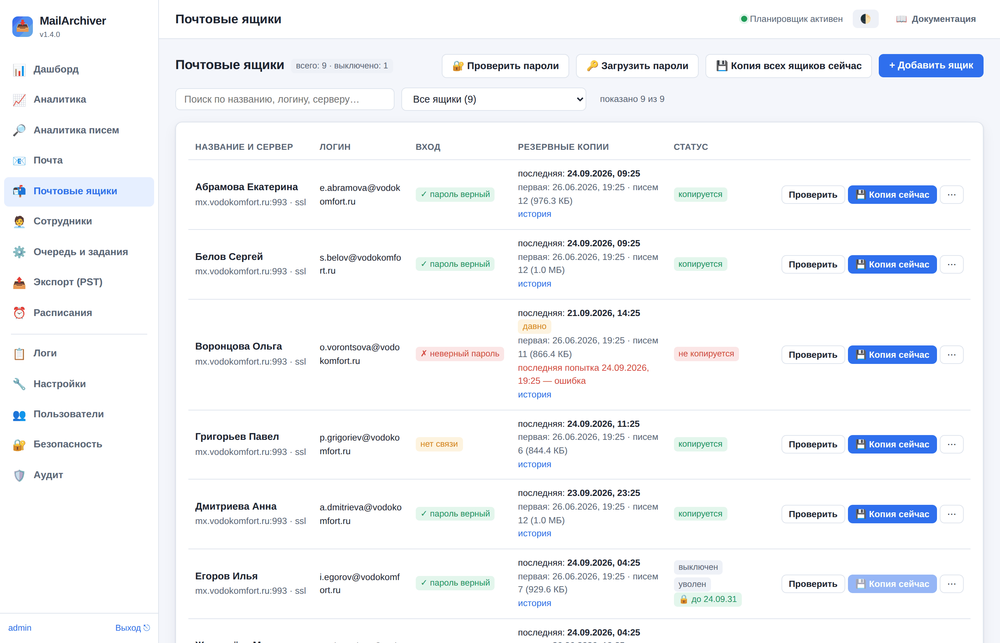
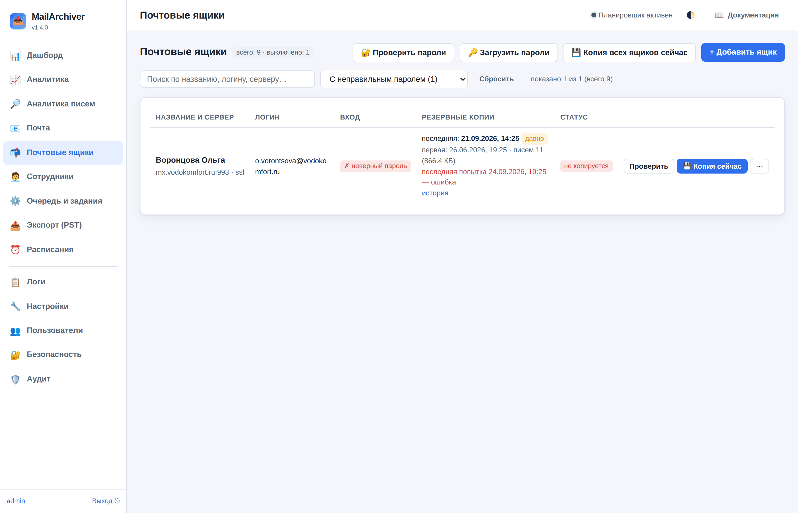
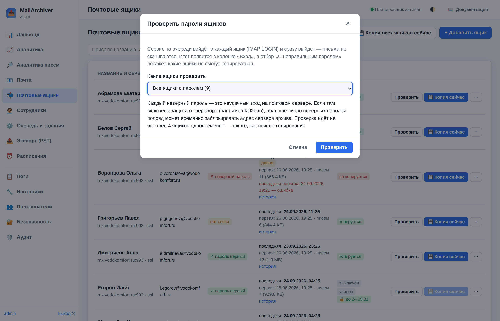

# Раздел «Почтовые ящики»: пароли, копии, отборы

Раздел показывает все ящики архива — вручную добавленные и заведённые
синхронизацией сотрудников — и помогает быстро найти те, что **не копируются**.

## Таблица ящиков

| Колонка | Что показывает |
|---|---|
| Название и сервер | имя ящика, сервер, порт и шифрование соединения |
| Логин | логин для входа в почту |
| Вход | итог последней проверки пароля: «✓ пароль верный», «✗ неверный пароль», «нет связи», «нет пароля», «пароль не читается», «не проверялся». Наведите курсор — видно время проверки и текст ошибки сервера |
| Резервные копии | дата **последней** удачной копии (и пометка «частично» или «давно»), дата **первой** копии, число писем и объём; если последняя попытка не удалась — её время красным |
| Статус | включён ли ящик в копирование |

Итог входа обновляется при каждом копировании ящика и при проверке паролей,
так что колонка «Вход» остаётся актуальной и без ручных проверок.

Ссылка «история» в строке открывает **историю копирования ящика**: даты
прогонов, итог, сколько новых писем скачано и сколько было ошибок.

## Отборы

Список над таблицей:

- **С неправильным паролем** — сервер отверг логин или пароль (либо пароль не
  расшифровывается, потому что заменён файл `secret.key`). Такие ящики не
  копируются, пока пароль не исправят.
- **Нет связи при проверке входа** — сервер не ответил (сеть, DNS, неверный порт).
- **Пароль не проверялся** — пароль задан, но вход ещё ни разу не проверялся.
- **Без резервных копий** — у ящика нет ни одной удачной копии.
- **Копия старше 72 ч** — включённый ящик, у которого удачной копии не было
  больше трёх суток.
- **Последняя копия с ошибкой** — последний прогон копирования завершился ошибкой.
- **Уволенные сотрудники**, **Архив удерживается**, **Удержание истекло** — ящики
  уволенных и ящики с удержанием архива (см. [сотрудники, 7.8](07-employees.md)).
- а также «Только включённые», «Только выключенные», «Готовые к копированию»,
  «Без пароля».

Рядом со строкой поиска (по названию, логину и серверу) — счётчик «показано N
из M». Плашка «Требуют внимания» на дашборде ведёт в эти же отборы.

## Проверить пароли всех ящиков

Кнопка «🔐 Проверить пароли» запускает фоновое задание: сервис по очереди
входит в каждый ящик (IMAP LOGIN) и сразу выходит — письма не скачиваются.
Можно проверить все ящики с паролем, только включённые или только те, что
показаны в текущем отборе. Ход проверки виден над таблицей; по окончании
откроется отбор «С неправильным паролем», если такие нашлись.

Ящики со способом входа «Через администратора почты» проверяются этим входом —
им пароль не нужен (см. [вход через администратора](16-mailadmin.md)).

Проверка идёт не быстрее 4 ящиков одновременно. Каждый неверный пароль — это
неудачный вход на почтовом сервере: если там включена защита от перебора
(fail2ban и т. п.), большое число неверных паролей подряд может временно
заблокировать адрес архива. Поэтому сначала исправьте пароли, которые уже
известны как неверные.

## Загрузить пароли из файла

«🔑 Загрузить пароли» принимает таблицу XLSX, CSV или XML с двумя колонками:
адрес ящика и пароль. Удобнее всего с заголовками «email» и «пароль» — тогда
в файле могут быть и другие колонки, а в колонке адреса допускается логин без
домена. Без заголовков колонок должно быть ровно две.

Строки, которые могли бы тихо записать неверный пароль, пропускаются с
понятной причиной: пароль совпадает с адресом (колонки перепутаны), адрес
встречается дважды, Excel превратил пароль в дату, «TRUE/FALSE» или дробное
число (отформатируйте колонку паролей как текст). Пароли сохраняются в базе
зашифрованными и никуда не выводятся.

## Меню ящика

Кнопка «⋯» в строке ящика:

- **Сделать резервную копию сейчас**, **Просмотр писем**, **Редактировать**.
- **Экспорт** в PST / EML / MBOX и **Восстановить на сервер**.
- **Хранение копий** — срок хранения локальной копии этого ящика: 3 дня,
  неделя, «хранить всё» или свой срок в днях. Очистка идёт ежедневно (время —
  «Настройки → Хранение и очистка → Время ежедневной очистки»). Письма на самом
  сервере не трогаются. Если срок увеличить, письма, удалённые по старому сроку
  и ещё лежащие на сервере, снова скачаются при следующем копировании.
- **Проверить целостность копии** и **Проверить папки на сервере** (какие папки
  не открываются и почему).
- **Скопировать заново** — пересоздать копию с нуля; прежние файлы уходят в
  «карантин» (**Прежние копии**) и удаляются только вручную.
- **Завершить сеансы сотрудника** — разлогинить сотрудника, вошедшего в
  интерфейс по паролю этого ящика.
- **Удержание архива** — письма ящика не удаляются по сроку хранения до
  указанной даты или бессрочно (для уволенных сотрудников ставится само, см.
  [сотрудники, 7.8](07-employees.md)).
- **Удалить ящик** — удаляет ящик из списка; файлы писем на диске остаются.
  Ящик, удалённый у сотрудника, ночная синхронизация заново не создаст.
- **Удалить ящик вместе с архивом писем** — удаляет и все файлы писем на диске
  (нужно ввести название ящика для подтверждения; необратимо). Пока действует
  удержание архива, пункт недоступен. Копия вне сервера удалит эти письма у себя
  при следующем прогоне (если включено «Удалять в копии удалённое из архива»).

## Способ входа в ящик

В карточке ящика поле «Способ входа»: **Логин и пароль** (обычный вход),
**OAuth2** (Gmail, Microsoft 365) или **Через администратора почты** — служба
входит учётной записью администратора почтового сервера «от имени» ящика, и
пароль сотрудника не нужен. Последний способ работает не на всех серверах —
подробно в разделе [вход через администратора](16-mailadmin.md).
