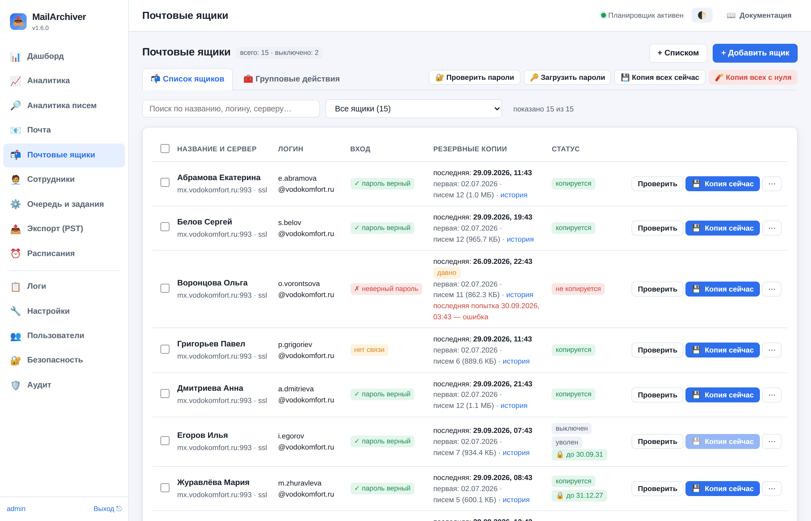
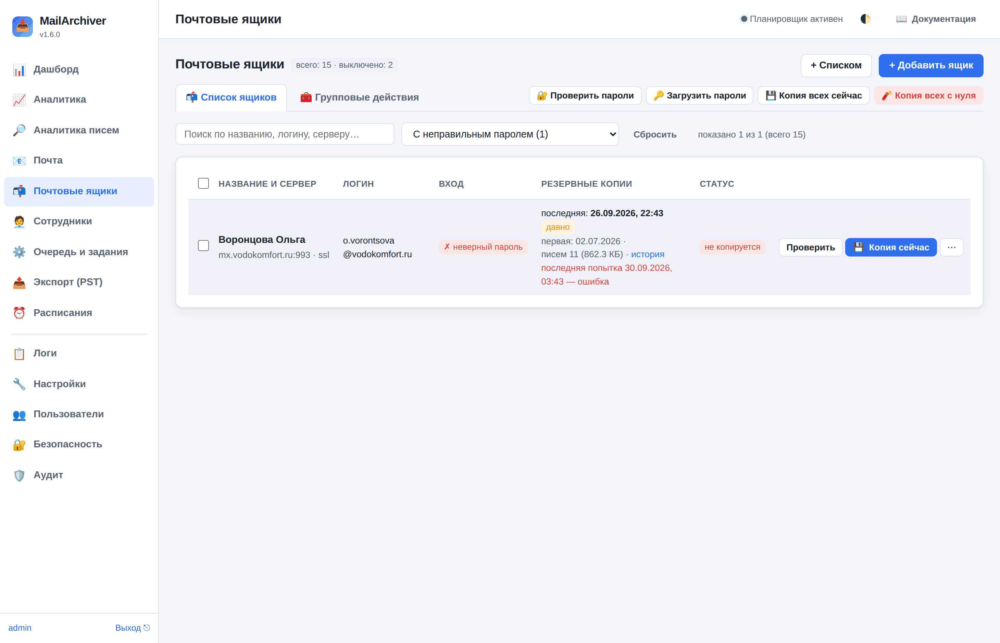
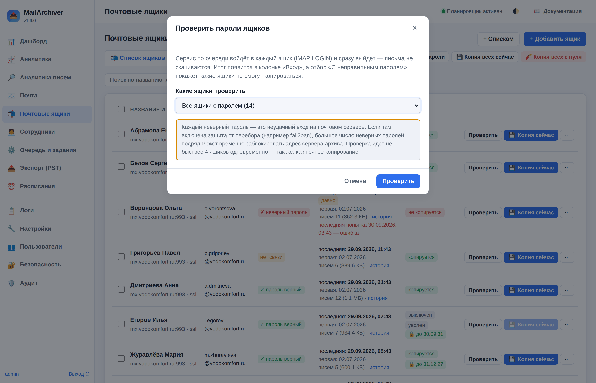
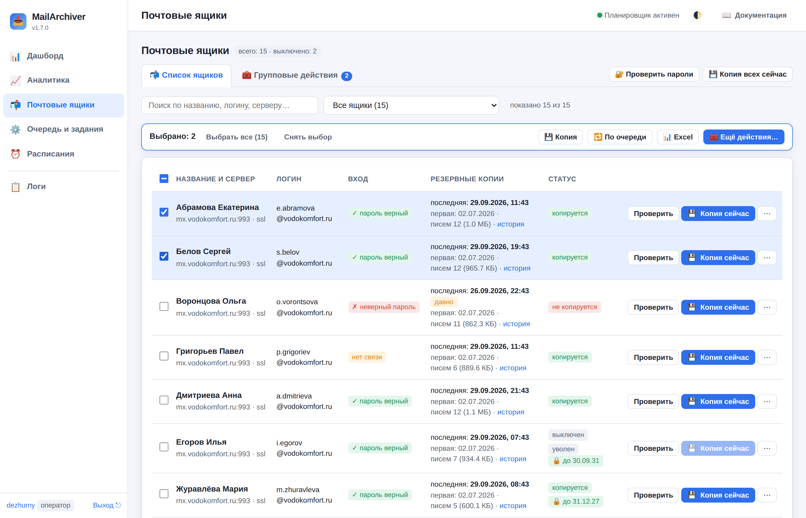
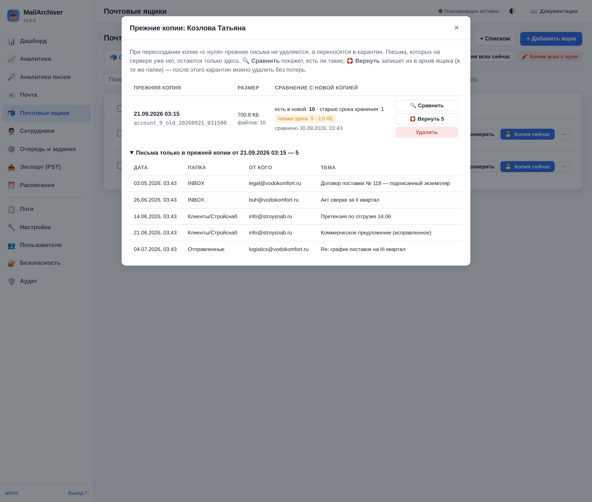

# Раздел «Почтовые ящики»: пароли, копии, отборы, групповые действия

Раздел показывает все ящики архива — вручную добавленные и заведённые
синхронизацией сотрудников — и помогает быстро найти те, что **не копируются**.

## Вкладки и кнопки

У администратора раздел состоит из двух вкладок:

- **📬 Список ящиков** — таблица ниже;
- **🧰 Групповые действия** — одно действие сразу для многих ящиков: копирование, включение,
  срок хранения, расписания, сервер, выгрузка, удаление… (подробно — [17-bulk.md](17-bulk.md)).
  Число на вкладке — сколько ящиков отмечено флажками.

Справа от вкладок — действия сразу со всеми ящиками:

| Кнопка | Что делает |
|---|---|
| 🔐 Проверить пароли | войти в каждый ящик и сразу выйти — найти неверные пароли (ниже) |
| 🔑 Загрузить пароли | проставить пароли из файла «адрес — пароль» (ниже) |
| 💾 Копия всех сейчас | копирование всех включённых ящиков: **параллельно** или **по очереди, ящик за ящиком** ([17.6](17-bulk.md)) |
| 🧨 Копия всех с нуля | прежние копии всех включённых ящиков уходят в карантин, письма скачиваются заново — с проверкой места на диске и подтверждением числом ящиков ([17.5](17-bulk.md)) |

Вверху — «**+ Списком**» (завести много ящиков сразу из списка адресов, [17.7](17-bulk.md)) и
«**+ Добавить ящик**».

## Таблица ящиков

| Колонка | Что показывает |
|---|---|
| ☐ (флажок) | выбор ящика для групповых действий; Shift + щелчок — диапазон, флажок в заголовке — все по отбору ([17.1](17-bulk.md)) |
| Название и сервер | имя ящика, сервер, порт и шифрование соединения |
| Логин | логин для входа в почту |
| Вход | итог последней проверки пароля: «✓ пароль верный», «✗ неверный пароль», «нет связи», «нет пароля», «пароль не читается», «не проверялся». Наведите курсор — видно время проверки и текст ошибки сервера |
| Резервные копии | дата и время **последней** удачной копии (и пометка «частично» или «давно»), дата **первой** копии, число писем и объём, ссылка «история»; если последняя попытка не удалась — её время красным |
| Статус | копируется ли ящик («копируется», «не копируется» — нет пароля или сервер отверг пароль, «выключен»), отметки об увольнении и удержании архива, «🧺 прежние копии» — после копии «с нуля» на диске остались прежние копии ящика |

Итог входа обновляется при каждом копировании ящика и при проверке паролей,
так что колонка «Вход» остаётся актуальной и без ручных проверок.

Справа в строке — кнопки «Проверить» (подключение к ящику), «💾 Копия сейчас» и «⋯» (меню ящика).
На экране уже 1400 точек (ноутбук) они показываются значками: 🔌 — проверить, 💾 — копия сейчас;
подпись видна при наведении.

Ссылка «история» в строке открывает **историю копирования ящика**: даты
прогонов, итог, сколько новых писем скачано и сколько было ошибок.

Отмеченные флажками ящики собираются на панели «**Выбрано: N**» над таблицей: там сразу доступны
«💾 Копия», «🔁 По очереди», «▶️ Включить», «⏸️ Выключить», «📊 Excel» (список ящиков файлом) и
«🧰 Ещё действия…» — все групповые действия с этими ящиками.

## Отборы

Список над таблицей:

- **С неправильным паролем** — сервер отверг логин или пароль (либо пароль не
  расшифровывается, потому что заменён файл `secret.key`). Такие ящики не
  копируются, пока пароль не исправят.
- **Нет связи при проверке входа** — сервер не ответил (сеть, DNS, неверный порт).
- **Пароль не проверялся** — пароль задан, но вход ещё ни разу не проверялся.
- **Без резервных копий** — у ящика нет ни одной удачной копии.
- **Копия старше 72 ч** — включённый ящик, у которого удачной копии не было
  больше трёх суток.
- **Последняя копия с ошибкой** — последний прогон копирования завершился ошибкой.
- **Уволенные сотрудники**, **Архив удерживается**, **Удержание истекло** — ящики
  уволенных и ящики с удержанием архива (см. [сотрудники, 7.8](07-employees.md)).
- **Есть прежние копии (после «с нуля»)** — ящики, у которых на диске лежат прежние копии
  (карантин): их стоит сравнить с новыми и удалить, когда они больше не нужны.
- а также «Только включённые», «Только выключенные», «Готовые к копированию»,
  «Без пароля».

Рядом со строкой поиска (по названию, логину и серверу) — счётчик «показано N
из M». Плашка «Требуют внимания» на дашборде ведёт в эти же отборы.

## Проверить пароли всех ящиков

Кнопка «🔐 Проверить пароли» запускает фоновое задание: сервис по очереди
входит в каждый ящик (IMAP LOGIN) и сразу выходит — письма не скачиваются.
Можно проверить все ящики с паролем, только включённые или только те, что
показаны в текущем отборе. Ход проверки виден над таблицей; по окончании
откроется отбор «С неправильным паролем», если такие нашлись.

Ящики со способом входа «Через администратора почты» проверяются этим входом —
им пароль не нужен (см. [вход через администратора](16-mailadmin.md)).

Проверка идёт не быстрее 4 ящиков одновременно. Каждый неверный пароль — это
неудачный вход на почтовом сервере: если там включена защита от перебора
(fail2ban и т. п.), большое число неверных паролей подряд может временно
заблокировать адрес архива. Поэтому сначала исправьте пароли, которые уже
известны как неверные.

## Загрузить пароли из файла

«🔑 Загрузить пароли» принимает таблицу XLSX, CSV или XML с двумя колонками:
адрес ящика и пароль. Удобнее всего с заголовками «email» и «пароль» — тогда
в файле могут быть и другие колонки, а в колонке адреса допускается логин без
домена. Без заголовков колонок должно быть ровно две.

Строки, которые могли бы тихо записать неверный пароль, пропускаются с
понятной причиной: пароль совпадает с адресом (колонки перепутаны), адрес
встречается дважды, Excel превратил пароль в дату, «TRUE/FALSE» или дробное
число (отформатируйте колонку паролей как текст). Пароли сохраняются в базе
зашифрованными и никуда не выводятся.

## Меню ящика

Кнопка «⋯» в строке ящика. У **оператора** ([роли — 8-security.md](08-security.md)) в меню только
копия сейчас, проверки (подключение, целостность, папки на сервере), «Докачать потерянные письма» и
история копирования; кнопки «+ Добавить ящик», «Загрузить пароли», «Копия всех с нуля»,
«Включить» / «Выключить» ему не показываются.

- **Сделать резервную копию сейчас**, **Просмотр писем**, **Редактировать**.
- **Экспорт** в PST / EML / MBOX и **Восстановить на сервер**.
- **Хранение копий** — срок хранения локальной копии этого ящика: 3 дня,
  неделя, «хранить всё» или свой срок в днях. Очистка идёт ежедневно (время —
  «Настройки → Хранение и очистка → Время ежедневной очистки»). Письма на самом
  сервере не трогаются. Письма старше срока хранения копирование и не скачивает — ни при первом
  копировании, ни после копии «с нуля». Если срок увеличить, письма, удалённые (или не скачанные)
  по старому сроку и ещё лежащие на сервере, скачаются при следующем копировании. В том же окне
  видно, сколько писем **отсеяно по сроку**, и есть кнопка **«Забыть отсеянные письма»**:
  следующее копирование заново проверит их даты на сервере (моложе срока — скачаются, старше —
  снова будут пропущены). Она нужна, если часы сервера архива уходили вперёд или у писем на
  почтовом сервере были неверные даты.
- **Проверить целостность копии** и **Проверить папки на сервере** (какие папки
  не открываются и почему). Сразу для многих ящиков — групповое действие «🩺 Проверить папки на
  сервере» ([17-bulk.md](17-bulk.md)).
- **Скопировать заново** — «Докачать потерянные письма» (ничего не удаляется) или «Полностью с
  нуля»: сначала проверяется вход в ящик, потом прежние файлы уходят в карантин
  `account_<номер>_old_<дата>`, а письма скачиваются заново.
- **Прежние копии (карантин)** — прежние копии ящика после копии «с нуля»: сравнение с новой
  копией, возврат писем, которых в новой нет, и удаление (ниже). В пункте меню — число прежних
  копий.
- **Завершить сеансы сотрудника** — разлогинить сотрудника, вошедшего в
  интерфейс по паролю этого ящика.
- **Удержание архива** — письма ящика не удаляются по сроку хранения до
  указанной даты или бессрочно, а сам архив нельзя удалить, пересоздать «с нуля» или удалить его
  прежние копии (для уволенных сотрудников ставится само, см.
  [сотрудники, 7.8](07-employees.md)).
- **Удалить ящик** — удаляет ящик из списка; файлы писем на диске остаются.
  Ящик, удалённый у сотрудника, ночная синхронизация заново не создаст. Пока действует удержание
  архива или по ящику идёт задание, удалить его нельзя.
- **Удалить ящик вместе с архивом писем** — удаляет и все файлы писем на диске
  (нужно ввести название ящика для подтверждения; необратимо). Пока действует
  удержание архива, пункт недоступен. Копия вне сервера удалит эти письма у себя
  при следующем прогоне (если включено «Удалять в копии удалённое из архива»).

## Прежние копии: сравнить, вернуть, удалить

Копия «с нуля» не стирает прежние файлы ящика, а переносит их в карантин
`account_<номер>_old_<дата-время>`. Письма, которых на почтовом сервере уже нет, после этого лежат
**только там**: в просмотре, поиске и выгрузке их не видно. Окно «Прежние копии» помогает понять,
есть ли такие письма, вернуть их в архив и освободить место.

Для каждой прежней копии — число файлов, размер и итог **сравнения с новой копией**:

| Итог | Что значит |
|---|---|
| есть в новой | письмо с тем же содержимым есть в новой копии, и его файл на месте |
| другой вариант | тот же Message-ID, тема, отправитель, дата и тело письма, но другие заголовки — сервер пересобрал заголовки того же письма |
| только здесь | в новой копии письма нет: удалено на сервере, лежит в исключённой или неоткрывающейся папке, больше лимита размера |
| старше срока хранения | «только здесь», но старше срока хранения ящика — ночная очистка удалила бы их и так |
| не прочитано | файл не читается (нет ключа шифрования, файл повреждён) |

Письма «только здесь» показаны списком (дата, папка, отправитель, тема) — видно, что именно
потеряется при удалении.

Кнопки:

- **🔍 Сравнить** — сравнение фоновым заданием; ничего не меняет. После удачной копии «с нуля»
  оно запускается само (отдельным заданием — его номер есть в итоге копирования).
- **🛟 Вернуть N** — записать письма «только здесь» в архив ящика, в те же папки. Они станут
  видны в просмотре, поиске и выгрузке; копирование их не трогает и заново не скачивает. Кнопка
  доступна, когда копирование хотя бы раз **прочитало все папки** ящика после «с нуля» (ошибки
  отдельных писем не мешают): иначе письма ещё не прочитанных папок попали бы в архив дважды.
  Письма папок, которые сейчас не открываются на сервере (и не исключены из копирования), и
  письма старше срока хранения не возвращаются.
- **Удалить** — удаляет прежнюю копию фоновым заданием; перед удалением задание ещё раз сравнивает
  её с новой копией. Если сравнение не подтвердило, что все её письма есть в новой копии, удалить
  можно только с явным подтверждением «Удалить с потерей писем». Пока идёт задание с прежними копиями ящика (сравнение, возврат, удаление), кнопки
  недоступны, а вверху окна — ссылка на это задание; удержание архива запрещает удаление.

Сразу для многих ящиков — групповые действия «🔍 Сравнить прежние копии с новыми», «🛟 Вернуть
письма из прежних копий» и «🧺 Удалить прежние копии» ([17-bulk.md](17-bulk.md)).

## Способ входа в ящик

В карточке ящика поле «Способ входа»: **Логин и пароль** (обычный вход),
**OAuth2** (Gmail, Microsoft 365) или **Через администратора почты** — служба
входит учётной записью администратора почтового сервера «от имени» ящика, и
пароль сотрудника не нужен. Последний способ работает не на всех серверах —
подробно в разделе [вход через администратора](16-mailadmin.md).
