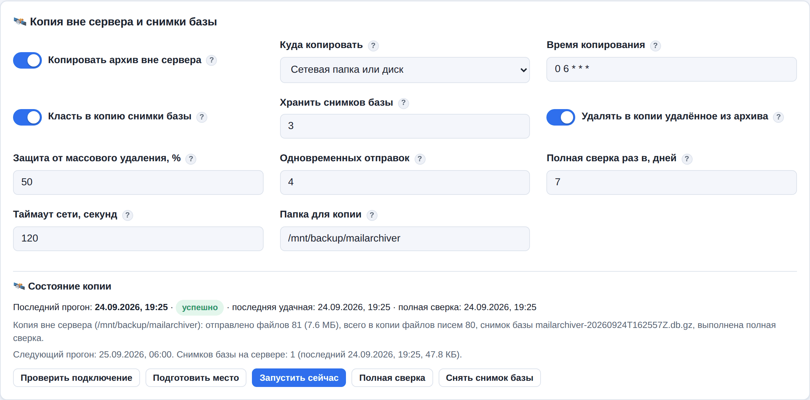

# 13. Копия архива вне сервера и снимки базы

Архив почты лежит на одном сервере. Если этот сервер пропадёт целиком — сгорит диск, данные
зашифрует вирус-вымогатель, по ошибке удалят виртуальную машину, — пропадёт и архив. Правило
надёжного резервного копирования «3-2-1» требует, чтобы хотя бы одна копия лежала **в другом
месте**. MailArchiver делает такую копию сам, каждый день.

Настройка — «Настройки → 🛰️ Копия вне сервера и снимки базы».



## Куда можно копировать

| Вариант | Что это | Когда выбрать |
|---------|---------|---------------|
| **Сетевая папка или диск** | Любой каталог, подключённый к серверу: общая папка Windows (SMB/CIFS), NFS, USB-диск | Есть файловый сервер или NAS в другой комнате / здании |
| **Сервер по SSH (rsync)** | Другой Linux-сервер; копирование программой rsync поверх SSH | Есть второй Linux-сервер, лучше — на другой площадке |
| **S3-хранилище** | Облачное хранилище: Yandex Object Storage, VK Cloud, Selectel, свой MinIO | Нужна копия за пределами офиса без своего оборудования |

## Что попадает в копию

- **Файлы писем** всех ящиков — ровно как они лежат в архиве. Если включено шифрование копии
  писем, в копию уходят уже зашифрованные файлы: хранилище или администратор NAS прочитать их не
  смогут.
- **Снимки базы данных** (каталог `db/` в копии) — индекс писем, ящики, расписания, настройки.
  Без базы копия писем — просто груда файлов: нет ни поиска, ни просмотра, ни выгрузки по ящикам.
  Снимок делается «на ходу» (служба не останавливается), проверяется на целостность, сжимается
  и — если включено шифрование писем — шифруется тем же ключом. Пароли ящиков в снимке и так
  зашифрованы ключом `secret.key`.
- Файл **README-MailArchiver.txt** — памятка, как восстановить архив из этой копии.

В копию **не попадают ключи** — и это сделано намеренно:

- `secret.key` из каталога данных (им зашифрованы пароли ящиков и секреты настроек);
- ключ шифрования писем (`storage.encryption_key_file`), если шифрование включено.

Храните их **отдельно** от копии (сейф, менеджер паролей, флешка у руководителя). Копия вместе с
ключами — это не защищённая копия.

## Снимки базы на самом сервере

Снимки делаются каждый день в «Время копирования», **даже если копия вне сервера выключена**, и
хранятся в каталоге `snapshots/` внутри каталога данных (по умолчанию — 3 последних). Это
защита от порчи базы на самом сервере: например, после сбоя диска или неудачного обновления.
Снимок можно сделать и вручную — кнопкой «Снять снимок базы» в карточке настроек.

## Настройка: сетевая папка

1. Подключите папку к серверу. Пример для общей папки Windows:

   ```bash
   sudo apt install cifs-utils
   sudo mkdir -p /mnt/backup
   # /etc/fstab — одной строкой; учётные данные в отдельном файле с правами 600:
   //nas.company.ru/mail  /mnt/backup  cifs  credentials=/etc/cifs-mail,uid=mailarchiver,gid=mailarchiver,file_mode=0600,dir_mode=0700,_netdev,nofail  0  0
   sudo mount /mnt/backup
   ```

   Важно: `uid=mailarchiver,gid=mailarchiver` — служба работает от имени пользователя
   `mailarchiver` и должна иметь право писать в папку.

2. В настройках выберите «Куда копировать: Сетевая папка или диск», укажите папку, например
   `/mnt/backup/mailarchiver`, сохраните.
3. Нажмите **«Проверить подключение»**, затем **«Подготовить место»**. В папке появится метка
   `.mailarchiver-replica`.
4. Включите «Копировать архив вне сервера» и нажмите «Запустить сейчас» — первая копия
   отправит весь архив (это долго), дальше каждый день уходят только новые письма.

> **Зачем метка.** Если сетевой диск отвалится, точка монтирования `/mnt/backup` останется
> пустой папкой на системном диске сервера. Без метки служба начала бы писать копию туда и
> забила бы системный диск. С меткой она видит, что метка пропала там, где копия уже была, и
> останавливается с ошибкой «Метка копии … пропала» (а в карточке настроек и в сводке видно,
> что копия не обновляется). Если место действительно новое или очищено намеренно, нажмите
> «Подготовить место». По той же причине служба не пишет копию в непустую папку без метки.

Папка не может быть в `/home` или `/root`: служба запущена с защитой systemd `ProtectHome` и
домашних каталогов не видит. Используйте `/mnt`, `/media` или `/srv`.

В именах файлов писем есть двоеточие (`…:2,S`), которое запрещено в Windows. В сетевой папке оно
записывается как `%3A`; команда `replica-pull` при восстановлении возвращает исходные имена.

## Настройка: сервер по SSH (rsync)

1. На сервере-получателе заведите пользователя и папку, установите rsync:
   `sudo apt install rsync`.
2. В настройках MailArchiver выберите «Сервер по SSH», укажите «Сервер и папку» в виде
   `backup@backup.company.ru:/srv/mailarchiver`, при необходимости порт.
3. Сохраните настройки и нажмите **«SSH-ключ службы»** — служба создаст ключ и покажет его
   открытую часть. Добавьте её одной строкой в файл `~/.ssh/authorized_keys` пользователя
   `backup` на сервере-получателе. (Ключ можно получить и командой
   `sudo mailarchiver replica-ssh-key`.)
4. «Проверить подключение» → «Подготовить место» → включить → «Запустить сейчас».

Ключ сервера-получателя запоминается при первом подключении (файл `replica_known_hosts` в
каталоге данных). Если потом ключ сервера изменится — например, кто-то подменил сервер, — копия
остановится с ошибкой «ключ сервера изменился». Если сервер действительно переустановили, удалите
его строку из `replica_known_hosts`.

Скорость можно ограничить параметром «Ограничение скорости (SSH)», чтобы копия не забирала
канал целиком в рабочее время.

## Настройка: S3-хранилище

1. В консоли хранилища создайте **бакет** и **сервисный аккаунт** с правом записи в этот бакет,
   выпустите для него **статический ключ доступа** (идентификатор и секрет).
2. В настройках выберите «S3», укажите адрес, регион, бакет, папку в бакете и ключи:

   | Хранилище | Адрес | Регион |
   |-----------|-------|--------|
   | Yandex Object Storage | `https://storage.yandexcloud.net` | `ru-central1` |
   | VK Cloud | `https://hb.ru-msk.vkcloud-storage.ru` | `ru-msk` |
   | Selectel | `https://s3.ru-1.storage.selcloud.ru` | `ru-1` |
   | Свой MinIO | `https://minio.company.ru:9000` | `us-east-1` (как настроено в MinIO) |

3. «Проверить подключение» → «Подготовить место» → включить → «Запустить сейчас».

Если хранилище требует адресовать бакет в имени сервера (`https://бакет.сервер/…`), выключите
параметр «Бакет в пути адреса».

Для копии, которую читают только при аварии, подходит «холодный» класс хранения (параметр
«Класс хранилища S3», например `COLD` в Yandex Object Storage или `STANDARD_IA`) — он дешевле
хранить, но дороже читать.

> **Совет.** Включите в бакете блокировку версий или «защиту от удаления» (Object Lock), если
> хранилище это умеет: тогда даже злоумышленник с ключом службы не сможет стереть копию.

## Как работает ежедневный прогон

- Отправляются только **новые** файлы — служба помнит, что уже отправлено. Первый прогон
  отправляет весь архив; его можно прервать — следующий продолжит с места остановки.
- Письма, удалённые из архива по сроку хранения, удаляются и в копии (параметр «Удалять в копии
  удалённое из архива»; выключите, если копия должна хранить всё, что когда-либо было в архиве).
- **Защита от массового удаления.** Если прогон собирается удалить в копии больше 50 % файлов
  (параметр «Защита от массового удаления»), он ничего не удаляет: так выглядит отключившийся
  диск с архивом, а не обычная очистка. В карточке настроек появится предупреждение и кнопка
  «Разрешить удаление и запустить» — разрешение действует на один прогон.
- Раз в неделю (параметр «Полная сверка раз в, дней») список файлов в самой копии сверяется с
  архивом целиком — так находятся файлы, пропавшие на стороне копии, и отправляются заново.
  Внеочередную сверку запускает кнопка «Полная сверка».
- Если копия не обновлялась больше двух суток, на дашборде появляется красная плашка, а в
  еженедельной сводке и в метриках мониторинга — соответствующая отметка.

## Восстановление после аварии

Пример: сервер MailArchiver потерян, копия лежит в S3 или сетевой папке, ключи сохранены
отдельно.

1. Установите MailArchiver на новый сервер (`sudo bash scripts/install.sh`) и остановите службу:

   ```bash
   sudo systemctl stop mailarchiver
   ```

2. Скачайте копию в каталог данных:

   ```bash
   # из сетевой папки
   sudo mailarchiver replica-pull --dir /mnt/backup/mailarchiver
   # из S3 (секретный ключ — в файле, чтобы он не остался в истории команд)
   sudo mailarchiver replica-pull --s3-endpoint https://storage.yandexcloud.net \
        --s3-bucket company-mail --s3-prefix mailarchiver/ --s3-region ru-central1 \
        --s3-access-key AKIA... --s3-secret-key-file /root/s3.secret
   ```

   Команда скачивает письма и снимки базы, возвращает исходные имена файлов и пропускает то, что
   уже скачано (её можно запускать повторно). Ключ `--only-db` — только снимки базы. Копию,
   сделанную по SSH, верните обычным rsync-ом в `/var/lib/mailarchiver/mailboxes/` и
   `/var/lib/mailarchiver/snapshots/`.

3. Положите на место ключи: `secret.key` — в каталог данных (`/var/lib/mailarchiver/secret.key`,
   владелец `mailarchiver`, права 600), ключ шифрования писем — по пути из настроек.

4. Восстановите базу из самого свежего снимка:

   ```bash
   sudo mailarchiver restore-snapshot mailarchiver-20260924T060000Z.db.gz.enc
   ```

   Если база уже есть, команда откажется её заменять без `--force` (прежняя база при этом
   сохраняется рядом как `…before-restore-<время>`). Для зашифрованного снимка ключ берётся из
   настроек или указывается явно: `--key /etc/mailarchiver/storage.key`.

5. Проверьте ключ шифрования (`sudo mailarchiver storage-key`) и запустите службу:
   `sudo systemctl start mailarchiver`.

## Проверка, что копия жива

- Карточка настроек показывает итог последнего прогона (что отправлено и удалено), дату
  последнего удачного прогона и полной сверки, время следующего прогона и снимки базы.
- Метрики мониторинга: `mailarchiver_replica_last_success_timestamp_seconds` и
  `mailarchiver_db_snapshot_timestamp_seconds` (см. [14-monitoring.md](14-monitoring.md)).
- Раз в квартал делайте **пробное восстановление** на тестовую машину по шагам выше — копия, из
  которой ни разу не восстанавливались, может оказаться бесполезной в самый нужный момент.
