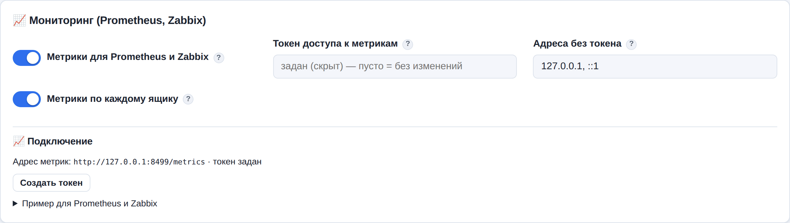

# 14. Мониторинг: Prometheus, Zabbix и еженедельная сводка

Резервное копирование, о поломке которого никто не узнал, — самое неприятное, что может случиться
с архивом: копии перестали делаться в марте, а выяснилось это в ноябре, когда понадобилось письмо.
MailArchiver сообщает о своём состоянии тремя способами:

1. **Уведомления на почту** о каждом неудачном задании (раздел настроек «Уведомления»).
2. **Еженедельная сводка** на почту — одно письмо в неделю со всем, что требует внимания.
3. **Метрики** для системы мониторинга (Prometheus, Zabbix, Grafana) по адресу `/metrics`.

## Еженедельная сводка

Раз в неделю (по умолчанию — в понедельник в 8:00) администраторам приходит письмо:

- какие ящики требуют внимания: неверный пароль, давно не копировались (больше 72 часов), последняя
  копия с ошибкой, нет ни одной копии, не задан пароль;
- сколько прогонов копирования было за неделю, сколько удачных, сколько новых писем и объём;
- размер архива, свободное место на диске и **на сколько дней его хватит** при нынешнем росте;
- состояние копии вне сервера и снимков базы;
- неудачные входы в веб-интерфейс за неделю.

Настройки: «Уведомления → Еженедельная сводка» и «Когда присылать сводку» (cron). Сводка приходит,
только если настроена отправка почты (SMTP) и уведомления включены. В карточке «Уведомления» есть
кнопки «Посмотреть сводку» (показывает текст письма прямо в интерфейсе) и «Отправить сейчас».

## Метрики `/metrics`

Включаются в «Настройки → 📈 Мониторинг (Prometheus, Zabbix)»: «Метрики для Prometheus и Zabbix».



Формат — текстовый формат Prometheus (его понимают Prometheus, VictoriaMetrics, Zabbix, Grafana
Agent, Telegraf).

### Кто может читать метрики

Метрики содержат названия ящиков и адреса почты, поэтому доступ ограничен:

- **без токена** — только с адресов из списка «Адреса без токена» (по умолчанию `127.0.0.1` и
  `::1`, то есть с самого сервера); можно указывать сети: `10.0.5.0/24`;
- **с токеном** — с любого адреса, если в запросе есть заголовок
  `Authorization: Bearer <токен>`. Токен задаётся в поле «Токен доступа к метрикам» (кнопка
  «Создать токен» в карточке придумает случайный), не короче 16 символов, хранится в базе
  зашифрованным и после сохранения больше не показывается.

Пока метрики выключены, адрес `/metrics` отвечает «404 — не найдено».

Проверка с самого сервера:

```bash
curl -s http://127.0.0.1:8493/metrics | head -30
# с другого сервера — с токеном:
curl -s -H "Authorization: Bearer ВАШ_ТОКЕН" https://mail-archive.company.ru/metrics
```

### Что в метриках

| Метрика | Что показывает |
|---------|----------------|
| `mailarchiver_info{version}` | Версия службы (всегда 1) |
| `mailarchiver_accounts{state}` | Ящики по состояниям: `total`, `enabled`, `bad_password`, `no_backup`, `stale` (копия старше 72 ч), `last_failed`, `no_password` |
| `mailarchiver_messages`, `mailarchiver_messages_bytes` | Писем в архиве и их объём |
| `mailarchiver_jobs{status}` | Заданий в очереди (`queued`) и выполняется (`running`) |
| `mailarchiver_jobs_failed_24h` | Заданий с ошибкой за сутки |
| `mailarchiver_disk_free_bytes`, `mailarchiver_disk_total_bytes` | Место на диске с письмами |
| `mailarchiver_encryption_blocked` | 1 — шифрование включено, но ключ недоступен (письма не сохраняются!) |
| `mailarchiver_scheduler_running` | 1 — планировщик работает |
| `mailarchiver_oldest_backup_age_seconds` | Давность самой старой «последней копии» среди включённых ящиков |
| `mailarchiver_replica_enabled` | Включена ли копия вне сервера |
| `mailarchiver_replica_last_success_timestamp_seconds` | Когда копия вне сервера последний раз прошла удачно (Unix-время) |
| `mailarchiver_replica_last_run_ok` | 1 — последний прогон копии удачный |
| `mailarchiver_db_snapshot_timestamp_seconds` | Время последнего снимка базы |
| `mailarchiver_login_failures_1h{kind}` | Неудачные входы за час: `password`, `otp` (коды 2FA), `imap` (вход сотрудников по паролю ящика) |
| `mailarchiver_account_enabled{account_id,account,username}` | Включено ли копирование ящика |
| `mailarchiver_account_last_backup_timestamp_seconds{…}` | Когда была последняя удачная копия ящика (0 — ни разу) |
| `mailarchiver_account_login_ok{…}` | Итог последней проверки входа в ящик (1 — пароль верный) |
| `mailarchiver_account_messages{…}`, `mailarchiver_account_bytes{…}` | Писем и объём архива ящика |

Метрики по каждому ящику (`mailarchiver_account_*`) можно выключить параметром «Метрики по
каждому ящику», если нужны только общие цифры. Тяжёлые показатели (размеры, диск) кэшируются на
5 минут, остальные — на 10 секунд, поэтому частый опрос службу не нагружает. Разумный интервал
опроса — 1 минута.

## Prometheus

```yaml
# prometheus.yml
scrape_configs:
  - job_name: mailarchiver
    scrape_interval: 60s
    scheme: https
    authorization:
      type: Bearer
      credentials: ВАШ_ТОКЕН           # или credentials_file: /etc/prometheus/mailarchiver.token
    static_configs:
      - targets: ["mail-archive.company.ru"]
```

Примеры правил оповещения:

```yaml
groups:
  - name: mailarchiver
    rules:
      - alert: MailArchiverDown
        expr: up{job="mailarchiver"} == 0
        for: 10m
        annotations: {summary: "MailArchiver не отвечает"}
      - alert: MailboxBackupStale
        # ящик включён, а удачной копии нет больше трёх суток (или не было никогда)
        expr: (time() - mailarchiver_account_last_backup_timestamp_seconds) > 3*86400
              and mailarchiver_account_enabled == 1
        for: 1h
        annotations: {summary: "Нет свежей копии ящика {{ $labels.account }}"}
      - alert: MailboxBadPassword
        expr: mailarchiver_accounts{state="bad_password"} > 0
        for: 1h
        annotations: {summary: "У {{ $value }} ящиков неверный пароль"}
      - alert: ReplicaStale
        expr: (time() - mailarchiver_replica_last_success_timestamp_seconds) > 2*86400
              and mailarchiver_replica_enabled == 1
        annotations: {summary: "Копия архива вне сервера не обновлялась больше двух суток"}
      - alert: ArchiveDiskLow
        expr: mailarchiver_disk_free_bytes / mailarchiver_disk_total_bytes < 0.10
        for: 30m
        annotations: {summary: "На диске с архивом меньше 10 % свободного места"}
      - alert: ArchiveEncryptionBlocked
        expr: mailarchiver_encryption_blocked == 1
        annotations: {summary: "Ключ шифрования недоступен — новые письма не сохраняются"}
```

## Zabbix

Zabbix читает формат Prometheus штатно: один элемент данных забирает всю страницу метрик, а
зависимые элементы выбирают из неё нужные числа.

1. **Главный элемент.** «Элементы данных → Создать»: тип «HTTP-агент», ключ
   `mailarchiver.metrics`, URL `http://127.0.0.1:8493/metrics` (или внешний адрес), заголовок
   `Authorization` = `Bearer ВАШ_ТОКЕН`, тип информации «Текст», интервал 1m, история — 1 час
   (хранить сам текст долго не нужно).
2. **Зависимые элементы.** Тип «Зависимый элемент», основной элемент — `mailarchiver.metrics`,
   на вкладке «Предобработка» шаг «Шаблон Prometheus» (Prometheus pattern):

   | Ключ элемента | Шаблон Prometheus |
   |---------------|-------------------|
   | `mailarchiver.bad_password` | `mailarchiver_accounts{state="bad_password"}` |
   | `mailarchiver.stale` | `mailarchiver_accounts{state="stale"}` |
   | `mailarchiver.no_backup` | `mailarchiver_accounts{state="no_backup"}` |
   | `mailarchiver.disk_free` | `mailarchiver_disk_free_bytes` |
   | `mailarchiver.failed_24h` | `mailarchiver_jobs_failed_24h` |
   | `mailarchiver.replica_ok` | `mailarchiver_replica_last_success_timestamp_seconds` |
   | `mailarchiver.encryption_blocked` | `mailarchiver_encryption_blocked` |

3. **Триггеры**, например:
   `last(/Host/mailarchiver.bad_password)>0` — «Есть ящики с неверным паролем»;
   `now()-last(/Host/mailarchiver.replica_ok)>172800` — «Копия вне сервера устарела»;
   `nodata(/Host/mailarchiver.metrics,10m)=1` — «MailArchiver не отвечает».

Для отдельного элемента на каждый ящик используйте обнаружение (LLD) с предобработкой
«Prometheus в JSON» по метрике `mailarchiver_account_last_backup_timestamp_seconds` и макросами
`{#ACCOUNT}` ← `$.labels.account`, `{#ACCOUNT_ID}` ← `$.labels.account_id`.

## Если служба за reverse proxy

Адрес клиента для списка «Адреса без токена» берётся так же, как для входа в интерфейс: из
заголовка `X-Forwarded-For` — только если включён `server.behind_proxy` и запрос пришёл от
доверенного прокси (`server.trusted_proxies`). Надёжнее всего внешнему мониторингу ходить **с токеном**, а список
адресов оставить по умолчанию (только сам сервер).
