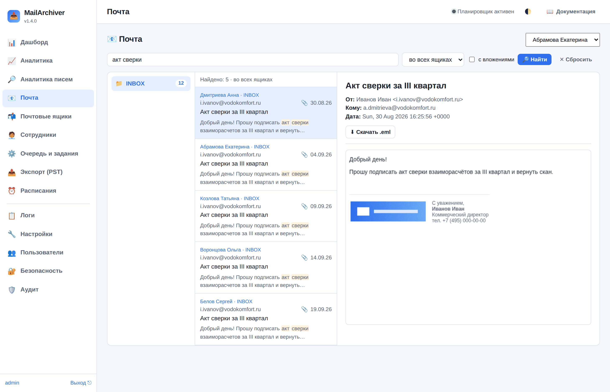

# 15. Поиск по письмам

«Найди письмо от поставщика с актом сверки за прошлый год» — самая частая просьба к архиву. В
разделе «📧 Почта» над списком писем есть строка поиска: она ищет по теме, отправителю и
получателям, именам вложений и тексту писем — в одном ящике или (администратору) во всех сразу.

## Как искать

Введите слова и нажмите «Найти» (или Enter).

| Запрос | Что найдёт |
|--------|-----------|
| `счёт оплата` | Письма, где есть **оба** слова (в любом поле). Слова ищутся по началу: «счет» найдёт «счета», «счетов» |
| `"акт сверки"` | Слова подряд, именно в таком порядке |
| `тема:договор` | Слово только в теме |
| `от:ivanov@company.ru` или `кому:petrov` | Отправитель или получатели (поля «От», «Кому», «Копия») |
| `вложение:прайс` | Имя вложенного файла |
| `текст:реквизиты` | Только в тексте письма |
| `1234-56` | Номер через дефис — ищется как единое целое |

Буквы «ё» и «е» не различаются, регистр букв — тоже. Операторы вроде `OR`, `NOT`, скобок
специального смысла не имеют — это просто слова, поэтому запрос никогда не «ломается».

- **«в этом ящике» / «во всех ящиках»** — где искать (второй вариант — только администратору);
- **«с вложениями»** — только письма, где есть вложения;
- результаты — от новых к старым, найденные слова подсвечены в отрывке текста; клик открывает
  письмо. «Показать ещё» догружает следующую страницу.

Сотрудник, вошедший по паролю своего ящика, ищет **только в своём ящике** — выбрать другой нельзя
ни в интерфейсе, ни через API.

## Индекс поиска

Чтобы поиск был мгновенным, письма заранее разбираются в **индекс** (таблица полнотекстового
поиска SQLite FTS5 в базе данных). Новые письма индексируются в фоне: каждые 10 минут
планировщик ставит задание «Индексация поиска», если появились непроиндексированные письма.

- **Первое индексирование** большого архива идёт долго: каждое письмо читается один раз
  (ориентир — сотни писем в секунду). Оно идёт порциями по 10 минут, между ними очередь
  пропускает копирования ящиков. Поиск работает сразу — по уже проиндексированной части; сколько
  проиндексировано, видно над строкой поиска и в «Настройки → 🔎 Поиск по письмам».
- **Размер индекса** — примерно 5–6 КБ на письмо при индексации текста (из текста выбрасываются
  цитаты прошлых писем переписки, берётся до 16 КБ текста одного письма — параметр «Текста
  письма в индексе, КБ»). Без текста — в несколько раз меньше.
- Письма, удалённые из архива (срок хранения, удаление ящика), исчезают из индекса сами.
- **«Перестроить индекс»** (в карточке настроек) очищает индекс и заполняет его заново. Нужно
  после смены настроек индексации текста.

## Поиск и шифрование

Если включено шифрование копии писем, **текст писем по умолчанию не индексируется**: индекс
хранится в базе открыто, и в нём оказалось бы то, что шифрование должно прятать. Тема, адреса и
имена вложений индексируются всегда — они и так хранятся в базе (в списке писем). Включить
индексацию текста при шифровании можно параметром «Текст писем в индексе при шифровании» — только
если база данных защищена так же надёжно, как ключ шифрования.

## Аудит

Поиск по чужой почте — это доступ к переписке. Каждый поиск администратора записывается в аудит
(разделы «🛡️ Аудит» и «🔐 Безопасность»): кто искал, что и где — «все ящики» или номер ящика,
и сколько нашлось.

## Если SQLite без FTS5

В редких сборках SQLite нет модуля FTS5. Тогда поиск работает «по-простому» — только по теме и
отправителю из списка писем (медленнее, без текста писем), о чём сообщается над строкой поиска.
Все современные дистрибутивы Linux и образ Docker собраны с FTS5.

## API

`GET /api/search?q=…&scope=all|account&account_id=N&attach=true&date_from=2025-01-01&date_to=2025-12-31&folder=INBOX&offset=0&limit=50`
— результаты с отрывками текста (`snippet`, найденное обрамлено символами `\x02` и `\x03`).
`GET /api/search/status` — сколько проиндексировано, `POST /api/search/reindex` — перестроить
индекс (только администратор).
