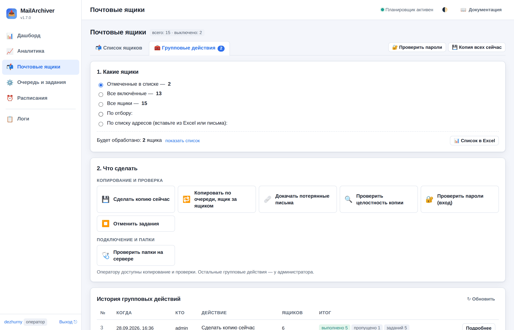
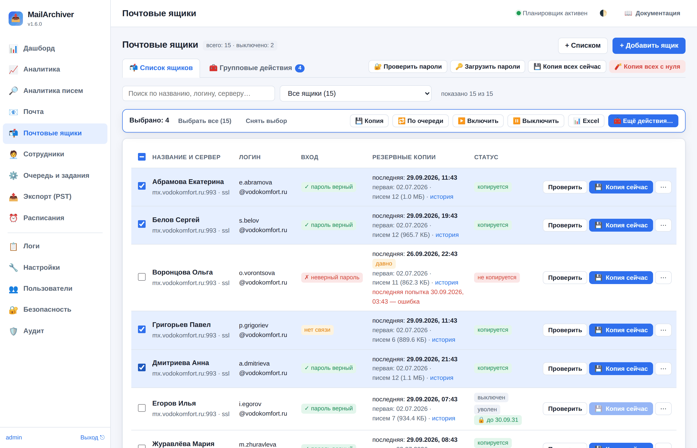
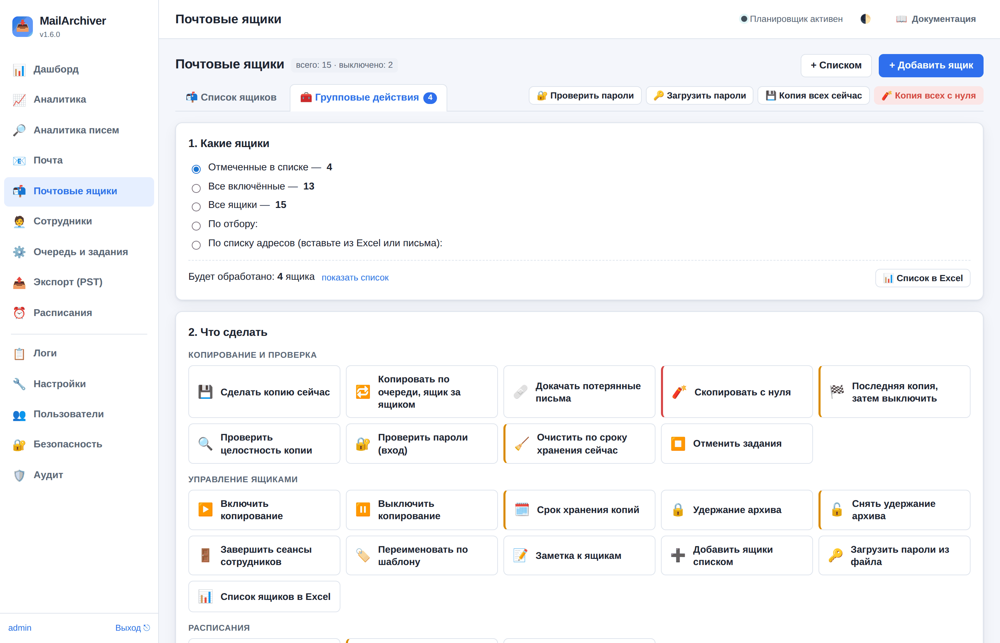
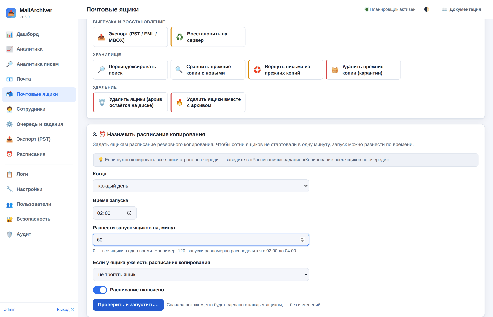
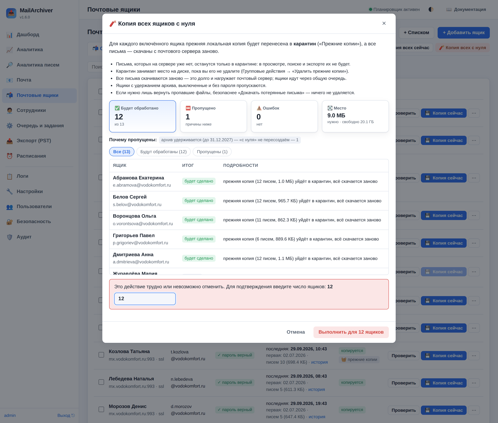
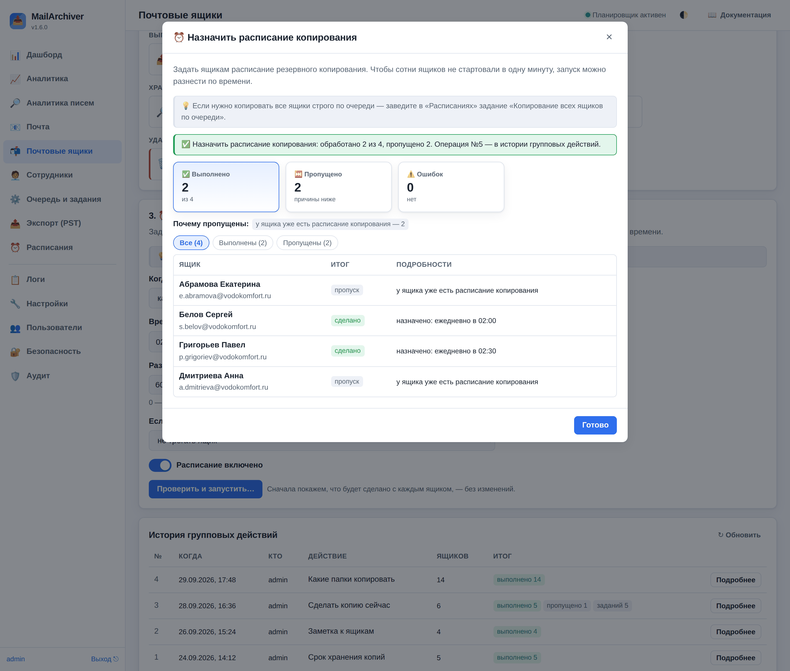
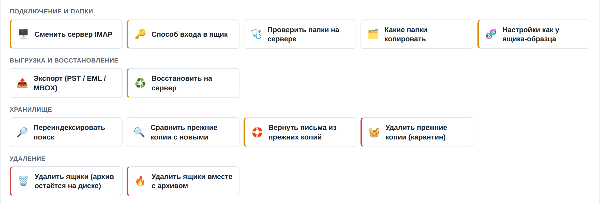
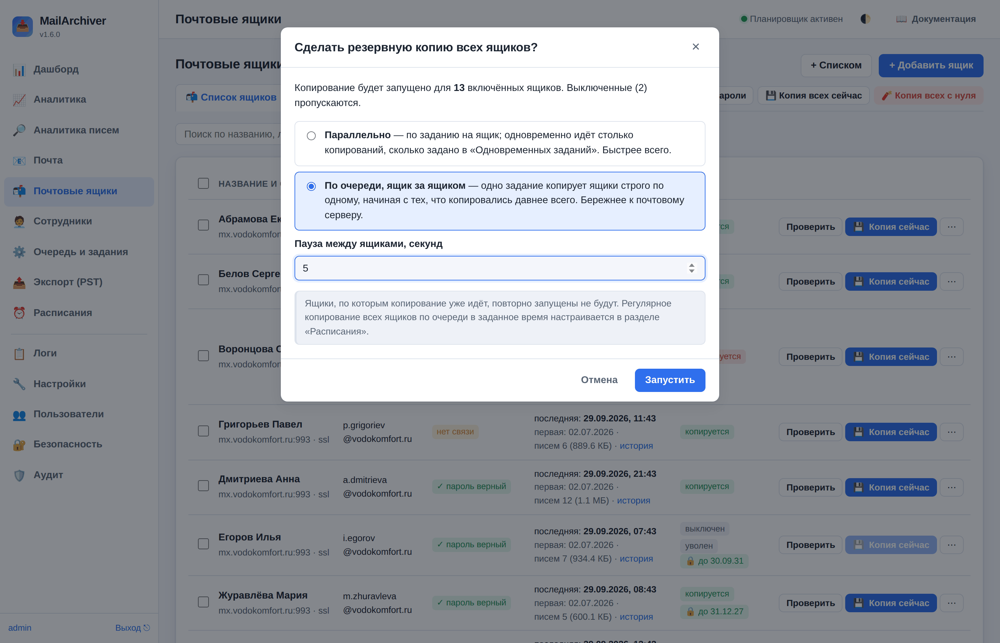
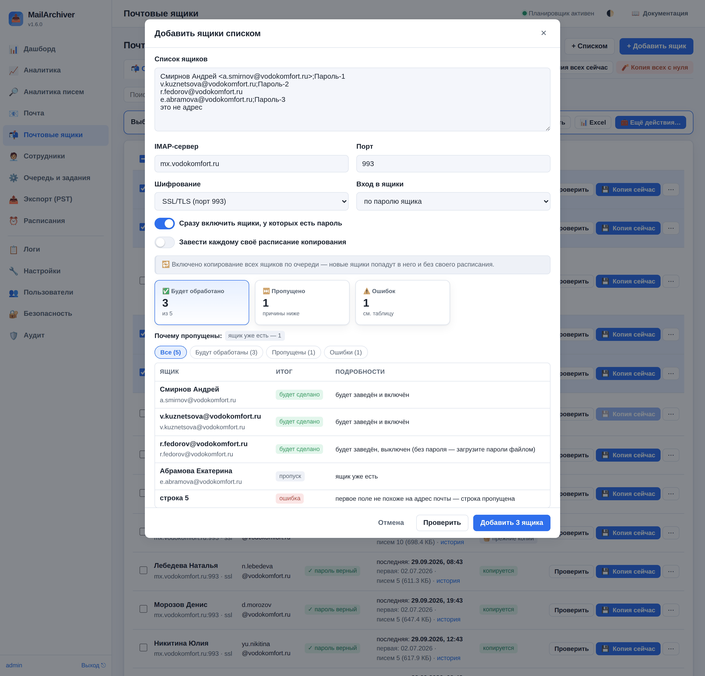
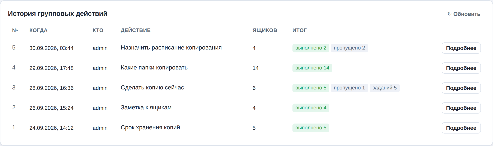

# 17. Групповые действия с ящиками

Когда ящиков сотни, менять что-то по одному ящику невозможно. Раздел **«Почтовые ящики →
🧰 Групповые действия»** делает то же, что меню «⋯» у ящика, но сразу для многих: копирование и
проверки, включение и выключение, срок хранения, расписания, сервер и способ входа, выгрузки,
удаление. Всё доступно администратору; **оператору** ([роли — 8-security.md](08-security.md)) —
только копирование и проверки («Сделать копию сейчас», «По очереди», «Докачать потерянные»,
«Проверить целостность», «Проверить пароли», «Проверить папки на сервере»), «Отменить задания»
(только копирование и проверки) и список ящиков в Excel. В истории оператор видит только такие
операции.



Главное правило раздела: **сначала проверка, потом действие.** Перед запуском программа
показывает, что будет сделано с каждым ящиком и какие ящики будут пропущены (и почему), — и ничего
не меняет, пока вы не нажмёте «Выполнить».

## 17.1. Выбор ящиков в списке



На вкладке «📬 Список ящиков» у каждой строки есть флажок:

- щелчок по флажку отмечает ящик, **Shift + щелчок** — все ящики между двумя щелчками;
- флажок в заголовке таблицы отмечает все ящики, **попавшие под отбор и поиск**;
- выбор не сбрасывается при смене отбора — ящики, которые сейчас скрыты отбором, считаются отдельно
  («скрыто отбором: N»).

Как только выбран хотя бы один ящик, над таблицей появляется панель «**Выбрано: N**» с частыми
действиями: **💾 Копия**, **🔁 По очереди**, **▶️ Включить**, **⏸️ Выключить**, **📊 Excel** и
**🧰 Ещё действия…** — переход в «Групповые действия», где отмеченные ящики уже выбраны.

## 17.2. Групповые действия: три шага

Любое групповое действие проходит одни и те же шаги: выбрать ящики, выбрать действие и его
параметры, посмотреть проверку и выполнить. Итог остаётся в истории.



**1. Какие ящики.** Пять способов указать ящики:

| Источник | Что попадёт |
|---|---|
| Отмеченные в списке | ящики, отмеченные флажками на вкладке «Список ящиков» |
| Все включённые | все ящики, которые сейчас копируются |
| Все ящики | вообще все, включая выключенные |
| По отбору | тот же отбор, что в списке («С неправильным паролем», «Без резервных копий», «Уволенные сотрудники»…), плюс поиск по названию, логину, серверу |
| По списку адресов | вставьте столбец из Excel или список из письма: по адресу, логину или названию ящика в строке (можно через запятую). Сразу видно, сколько найдено и какие адреса не найдены |

Строка «Будет обработано: N ящиков» показывает итог; «показать список» раскрывает сами ящики,
«📊 Список в Excel» выгружает их в файл.

**2. Что сделать.** Плитки сгруппированы по темам (таблица ниже). Цвет полоски слева:
без полоски — безопасные действия; **оранжевая** — меняет важные настройки или данные (сервер и
способ входа, срок хранения, расписания, удержание, очистка по сроку, восстановление на сервер);
**красная** — невозможно отменить: копия с нуля, удаление прежних копий, удаление ящиков.

**3. Параметры.** У многих действий есть настройки (срок хранения, время расписания, формат
выгрузки…). Кнопка «**Проверить и запустить…**» открывает окно проверки.



## 17.3. Проверка, подтверждение, итог

В окне проверки:

- плитки «Будет обработано», «Пропущено», «Ошибок»; для копирования «с нуля» — ещё и **место на
  диске**: сколько нужно и сколько свободно (если может не хватить, появится предупреждение и
  переключатель «Запустить, даже если места на диске может не хватить»);
- «**Почему пропущены**» — причины пропуска с числом ящиков: «копирование ящика выключено»,
  «не задан пароль», «архив удерживается», «по ящику выполняется задание» и т. п.;
- таблица по каждому ящику: что именно будет сделано. Кнопки-фильтры над ней показывают только
  обрабатываемые, пропущенные или ошибочные строки;
- параметры, не заданные заранее, можно поменять прямо в окне — проверка пересчитается.



«Красные» действия (**копия с нуля, удаление прежних копий, удаление ящиков**), а также
восстановление в исходные папки без пробного прогона требуют ввести **число ящиков** — так случайный
щелчок не удалит архив. Кнопка «Выполнить для N ящиков» станет доступна после ввода.



После выполнения в том же окне — итог по каждому ящику. Если действие ставит задания в очередь
(копирование, проверка, экспорт…), у ящика будет ссылка на его задание, а внизу — кнопка «⚙️ Открыть
очередь заданий».

## 17.4. Что можно сделать

**Копирование и проверка**

| Действие | Что делает |
|---|---|
| 💾 Сделать копию сейчас | обычное (инкрементальное) копирование; ящики идут параллельно — сколько позволяет «Одновременных заданий». Пропускаются выключенные, без пароля и те, что уже копируются или стоят в очереди |
| 🔁 Копировать по очереди, ящик за ящиком | **одно** задание копирует выбранные ящики строго по одному, начиная с тех, что копировались давнее всего; можно задать паузу между ящиками. Бережнее к почтовому серверу (подробно — [18.2](18-schedules.md)) |
| 🩹 Докачать потерянные письма | сверяет индекс с файлами на диске; письма, файлы которых пропали, скачиваются заново. Ничего не удаляется |
| 🧨 Скопировать с нуля | прежняя копия каждого ящика уходит в карантин («Прежние копии»), все письма скачиваются заново (см. 17.5). Подтверждается числом ящиков |
| 🏁 Последняя копия, затем выключить | копирование и сразу после него — выключение ящика. Не получилась копия — ящик остаётся включённым, чтобы её можно было повторить |
| 🔍 Проверить целостность копии | читает каждое письмо копии и сверяет контрольную сумму |
| 🔐 Проверить пароли (вход) | одно задание входит в каждый ящик и сразу выходит; итог — в колонке «Вход» |
| 🧹 Очистить по сроку хранения сейчас | удаляет из копии письма старше срока хранения ящика, не дожидаясь ночной очистки |
| ⏹️ Отменить задания | снимает задания выбранных ящиков: все, только копирования или только стоящие в очереди |

**Управление ящиками**

| Действие | Что делает |
|---|---|
| ▶️ Включить / ⏸️ Выключить копирование | при выключении можно сразу снять стоящие в очереди копирования этих ящиков; архив писем не трогается |
| 🗓️ Срок хранения копий | «как в общих настройках», «хранить всё», 3 дня, неделя, 2 недели, 30 дней, 3 месяца, полгода, год, 2, 3 или 5 лет или свой срок; можно сразу запустить очистку. Удерживаемые архивы очистка не трогает |
| 🔒 Удержание архива / 🔓 Снять удержание | до даты или бессрочно: письма не удаляются по сроку хранения, а ящик нельзя удалить (ни с архивом, ни без), пересоздать «с нуля» или удалить его прежние копии |
| 🚪 Завершить сеансы сотрудников | разлогинивает сотрудников, вошедших в интерфейс по паролю своего ящика |
| 🏷️ Переименовать по шаблону | названия по шаблону: `{employee}` — ФИО, `{department}` — отдел, `{position}` — должность, `{username}` — адрес, `{login}` — адрес до «@», `{domain}` — домен, `{name}` — прежнее название. Например, `{employee} ({department})` |
| 📝 Заметка к ящикам | дописать, заменить или стереть заметку администратора |
| ➕ Добавить ящики списком | см. 17.7 |
| 🔑 Загрузить пароли из файла | таблица «адрес — пароль» (см. [10-mailboxes.md](10-mailboxes.md)) |
| 📊 Список ящиков в Excel | см. 17.8 |

**Расписания**

| Действие | Что делает |
|---|---|
| ⏰ Назначить расписание копирования | «каждый день», «по будням», своё cron-выражение или интервал. **«Разнести запуск ящиков на N минут»** — чтобы сотни ящиков не стартовали в одну минуту: при 120 минутах и времени 02:00 запуски равномерно распределятся с 02:00 до 04:00. Если у ящика уже есть расписание — заменить его, не трогать ящик или добавить ещё одно |
| 🚫 Удалить расписания | только расписания копирования или все расписания ящиков — например, перед переходом на «Копирование всех ящиков по очереди» |
| ⏯️ Включить или выключить расписания | временно, не удаляя |



**Подключение и папки**

| Действие | Что делает |
|---|---|
| 🖥️ Сменить сервер IMAP | адрес, порт, шифрование (пустое поле — не менять). Если это **другой** почтовый сервер (переезд), у папок там другой UIDVALIDITY: письма, которые уже есть в архиве, копирование узнает по Message-ID, размеру и дате и **повторно не скачает**; скачаются только новые, пересобранные сервером и неоднозначные (подробно — [02-methodology.md](02-methodology.md)). Новое имя того же сервера ничего не меняет |
| 🩺 Проверить папки на сервере | одно задание по очереди открывает каждую папку выбранных ящиков (письма не скачиваются) и показывает по каждому ящику, какие папки не открываются и сколько в них писем — то есть из-за чего копия неполная. Сервер, не ответивший на 5 ящиках подряд, дальше не проверяется |
| 🔑 Способ входа в ящик | через администратора почты (пароли ящиков не нужны) или обратно — по паролям. Вход администратора сначала проверьте в «Настройках» ([16-mailadmin.md](16-mailadmin.md)); ящики на другом сервере и с входом OAuth2 пропускаются |
| 🗂️ Какие папки копировать | добавить в «Пропускать папки» (например, «Спам», «Корзина»), убрать оттуда, заменить список или ограничить копирование списком папок. Можно шаблоны: `Архив/*` |
| 🧬 Настройки как у ящика-образца | скопировать от одного ящика сервер и шифрование, способ входа, папки, срок хранения, расписания. Пароли не копируются |

**Выгрузка и восстановление**

| Действие | Что делает |
|---|---|
| 📤 Экспорт (PST / EML / MBOX) | по файлу на ящик, с отбором по датам и папкам. Файлы появятся в разделе «Экспорт» |
| ♻️ Восстановить на сервер | залить письма из копии обратно: в папки с префиксом (безопасно), в одну папку или в исходные папки. По умолчанию включены «Пробный прогон» и «Пропускать письма, которые уже есть на сервере» |

**Хранилище и удаление**

| Действие | Что делает |
|---|---|
| 🔎 Переиндексировать поиск | заново прочитать письма выбранных ящиков и обновить их в индексе поиска (тема, адреса, имена вложений, текст). Нужно, если поиск не находит письма ящика: текст писем начали индексировать уже после первого прохода, письма не читались без ключа шифрования. Остальной индекс не трогается; если файл письма не прочитался, прежняя запись в индексе остаётся |
| 🔍 Сравнить прежние копии с новыми | для каждой прежней копии (после «с нуля») выяснить, какие её письма есть в новой копии, а какие — только в ней. Ничего не меняет; по фоновому заданию на ящик ([10-mailboxes.md](10-mailboxes.md)) |
| 🛟 Вернуть письма из прежних копий | письма «только в прежней копии» записать в архив ящика, в те же папки. Только для ящиков, где копирование после «с нуля» хотя бы раз прочитало все папки; письма неоткрывающихся папок и старше срока хранения не возвращаются |
| 🧺 Удалить прежние копии (карантин) | удаляет карантинные копии, оставшиеся после копирования «с нуля»; фоновым заданием. По умолчанию — **только те, все письма которых есть в новой копии** (по сравнению); флажок «Только прежние копии, все письма которых есть в новой копии» можно снять — тогда письма «только в прежней копии» будут потеряны. Удаляются только те прежние копии, что были в проверке, — карантин, появившийся позже, останется; перед удалением сравнение перепроверяется. **Необратимо**, подтверждается числом ящиков |
| 🗑️ Удалить ящики (архив остаётся на диске) | удаляет ящики, их настройки, расписания и индекс писем. Файлы писем остаются в каталоге `account_<номер>` хранилища и занимают место, пока их не удалить вручную; ящик, заведённый заново, начнёт архив с чистого листа |
| 🔥 Удалить ящики вместе с архивом | удаляет ящики, индекс и **все файлы писем**, по умолчанию — и прежние копии (снимите флажок «Удалить и прежние копии (карантин)», чтобы их оставить). Ящики выключаются сразу, файлы удаляет фоновое задание. **Необратимо** |

Копирование «с нуля», удаление прежних копий и удаление ящиков пропускают удерживаемые архивы, а
также ящики, по которым сейчас идёт задание (отмените его или дождитесь окончания).

## 17.5. Копия всех ящиков с нуля

Кнопка **«🧨 Копия всех с нуля»** справа от вкладок — это действие «Скопировать с нуля» сразу для
всех **включённых** ящиков.

Что происходит с каждым ящиком:

1. Служба **сначала проверяет вход** в ящик. Если сервер недоступен или пароль сменился, копия не
   трогается — ящик завершится ошибкой, а прежний архив останется как был.
2. Прежний каталог писем **не удаляется, а переименовывается** в карантин
   `account_<номер>_old_<дата-время>` («Прежние копии» в меню ящика), индекс ящика очищается.
3. Все письма скачиваются с сервера заново.

Важно понимать:

- письма, которых на сервере уже нет, останутся **только в карантине**: в просмотре, поиске и
  экспорте их не будет. Если архив нужен и для удалённых на сервере писем, «с нуля» не делайте;
- карантин занимает место, пока его не удалить. Проверка перед запуском показывает, сколько места
  нужно и сколько свободно;
- все письма скачиваются заново — это долго и нагружает почтовый сервер. Ящики идут через общую
  очередь («Одновременных заданий»); запускайте вечером или на выходных;
- пропускаются ящики с удержанием архива, выключенные и без пароля;
- если пропало лишь несколько файлов, безопаснее «🩹 Докачать потерянные письма» — ничего не
  удаляется.

После удачного копирования прежняя копия каждого ящика **сама сравнивается с новой** — отдельным
фоновым заданием (номер — в итоге копирования). Итог виден в меню ящика → «Прежние копии» и в
групповых действиях:

1. «🔍 Сравнить прежние копии с новыми» — для ящиков, где сравнения ещё нет (например, копирование
   прошло с ошибками — такие ящики сами не сравниваются);
2. «🛟 Вернуть письма из прежних копий» — письма, которых нет в новой копии, возвращаются в архив;
3. «🧺 Удалить прежние копии» — по умолчанию удаляет только прежние копии, все письма которых есть
   в новой копии.

Задание «с нуля», прерванное перезапуском службы, прежнюю копию второй раз не переносит — оно
продолжает скачивание.

## 17.6. «Копия всех сейчас»: параллельно или по очереди



Кнопка **«💾 Копия всех сейчас»** спрашивает, как копировать все включённые ящики:

- **параллельно** — по заданию на ящик, одновременно идёт столько копирований, сколько задано в
  «Одновременных заданий». Быстрее всего;
- **по очереди, ящик за ящиком** — одно задание копирует ящики строго по одному, начиная с тех, что
  копировались давнее всего; можно задать паузу между ящиками. Бережнее к почтовому серверу.

Ящики, которые уже копируются, повторно не запускаются. Регулярное копирование всех ящиков по
очереди в заданное время настраивается в «Расписаниях» ([18-schedules.md](18-schedules.md)).

## 17.7. Добавить ящики списком



Кнопка **«+ Списком»** (или плитка «Добавить ящики списком»). По одному ящику в строке:

```
ivanov@company.ru;Пароль1
Петрова Анна <petrova@company.ru>;Пароль2
sidorov@company.ru
```

- пароль отделяется точкой с запятой (или запятой); можно вставить **две колонки из Excel** —
  адрес и пароль (третья колонка, если есть, — ФИО). Пароль из колонки Excel берётся как есть,
  вместе с пробелами;
- **без пароля** ящик заводится выключенным — пароли потом загрузите файлом («Загрузить пароли»)
  или переведите ящики на вход через администратора почты;
- если адрес есть в справочнике сотрудников, ящик получит ФИО и сразу свяжется с карточкой;
- уже заведённые адреса и повторы в списке пропускаются; непонятные строки показываются номером
  строки, а не содержимым (там мог оказаться пароль);
- сервер, порт и шифрование — общие для всего списка (по умолчанию — самые частые среди ваших
  ящиков); можно сразу завести каждому своё расписание копирования. Если включено «Копирование
  всех ящиков по очереди», новые ящики попадут в него и без своего расписания.

Кнопка «Проверить» показывает, что будет заведено; «Добавить N ящиков» — заводит. Пароли не
попадают ни в историю групповых действий, ни в аудит. За раз — до 5000 строк.

## 17.8. Список ящиков в Excel

«📊 Excel» на панели выбранных ящиков, «📊 Список в Excel» в пункте 1 и плитка «Список ящиков в
Excel» выгружают таблицу `.xlsx` (с закреплённой шапкой и автофильтром): название, логин, сервер,
порт, шифрование, способ входа, включено ли копирование, итог и время проверки входа, число писем и
размер копии, первая и последняя удачная копия, итог последней копии, срок хранения, удержание,
дата увольнения, сотрудник, отдел, должность, число расписаний, заметка. Паролей в файле нет.

## 17.9. История групповых действий



Внизу вкладки — 30 последних операций: когда, кто, что сделано, со сколькими ящиками и итог.
«Подробнее» показывает параметры, итог по каждому ящику и — если операция поставила задания — ход
этих заданий («завершено N из M») с кнопкой **«⏹️ Отменить незавершённые»**. В базе хранятся 300
последних операций (все — через API); каждая, кроме того, записывается в аудит.

## 17.10. Готовые сценарии

**Ящики пришли из синхронизации сотрудников без паролей.** «🔑 Загрузить пароли» — с флажком
«Включить ящики после установки пароля» ящики включатся сами. Или без паролей: групповые действия →
по отбору «Без пароля» → «🔑 Способ входа в ящик → через администратора почты», затем по отбору
«Только выключенные» → «▶️ Включить копирование». В конце — «🔐 Проверить пароли».

**Ночью почтовый сервер перегружен.** Групповые действия → «Все включённые» → «🚫 Удалить
расписания» (только копирования) → «Расписания» → «🔁 Копирование всех ящиков по очереди» в 01:00 с
«не начинать новые ящики после» 07:00.

**Сотрудники отдела уволены.** По списку адресов → «🏁 Последняя копия, затем выключить» →
«🔒 Удержание архива» на нужный срок.

**Не копировать спам и корзину.** Все ящики → «🗂️ Какие папки копировать» → «добавить в
„Пропускать папки“»: `Спам`, `Корзина`, `Spam`, `Trash`.

**Почта переехала на другой сервер.** Все ящики → «🖥️ Сменить сервер IMAP» → новый адрес. При
следующем копировании письма, которые уже есть в архиве, узнаются по Message-ID, размеру и дате и не
скачиваются второй раз; в итоге каждого ящика — «узнано в архиве писем — N».

**Почему копии «неполные».** По отбору «Последняя копия с ошибкой» → «🩺 Проверить папки на
сервере»: в итоге задания — по каждому ящику папки, которые не открываются, и сколько в них писем.
Пустые битые папки копию неполной не делают; остальные чинят на сервере или добавляют в
«Пропускать папки» («🗂️ Какие папки копировать»).

**После «Копии всех с нуля».** Дождитесь окончания копирования → по отбору «Есть прежние копии»
→ «🛟 Вернуть письма из прежних копий» (для ящиков, где они есть) → «🧺 Удалить прежние копии».
