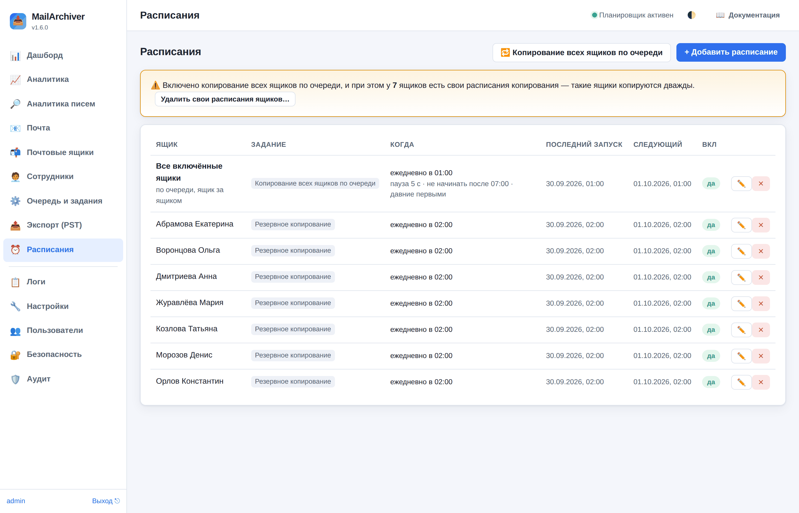
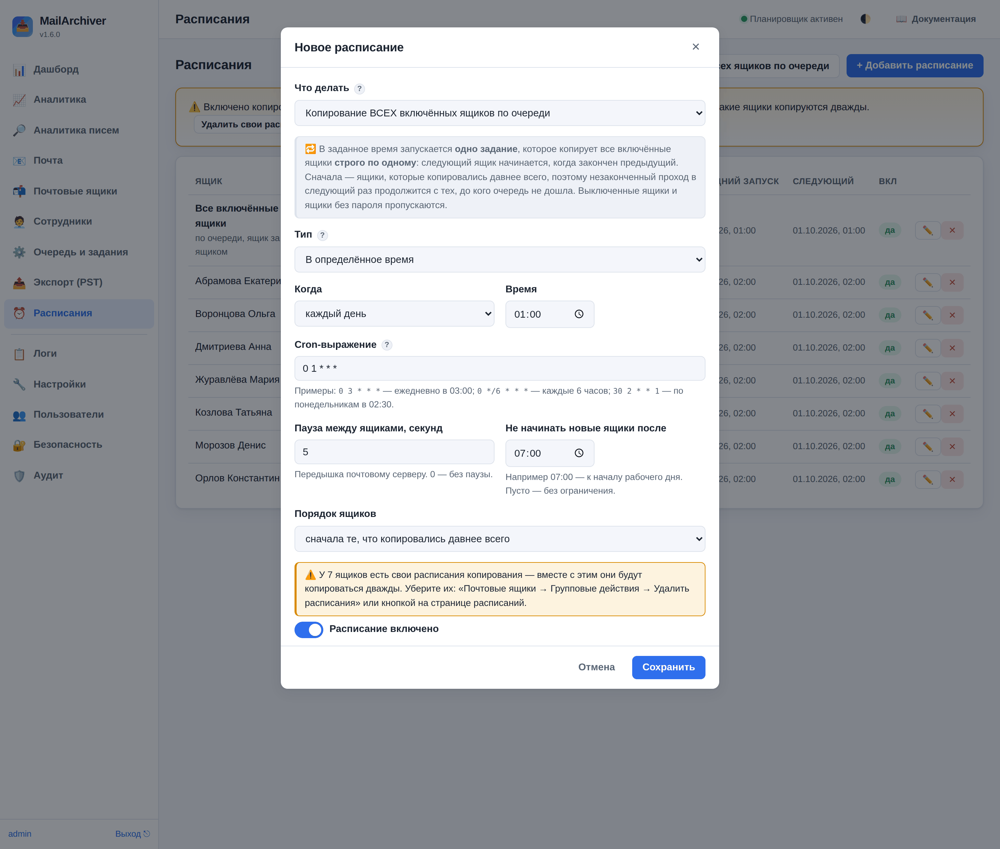
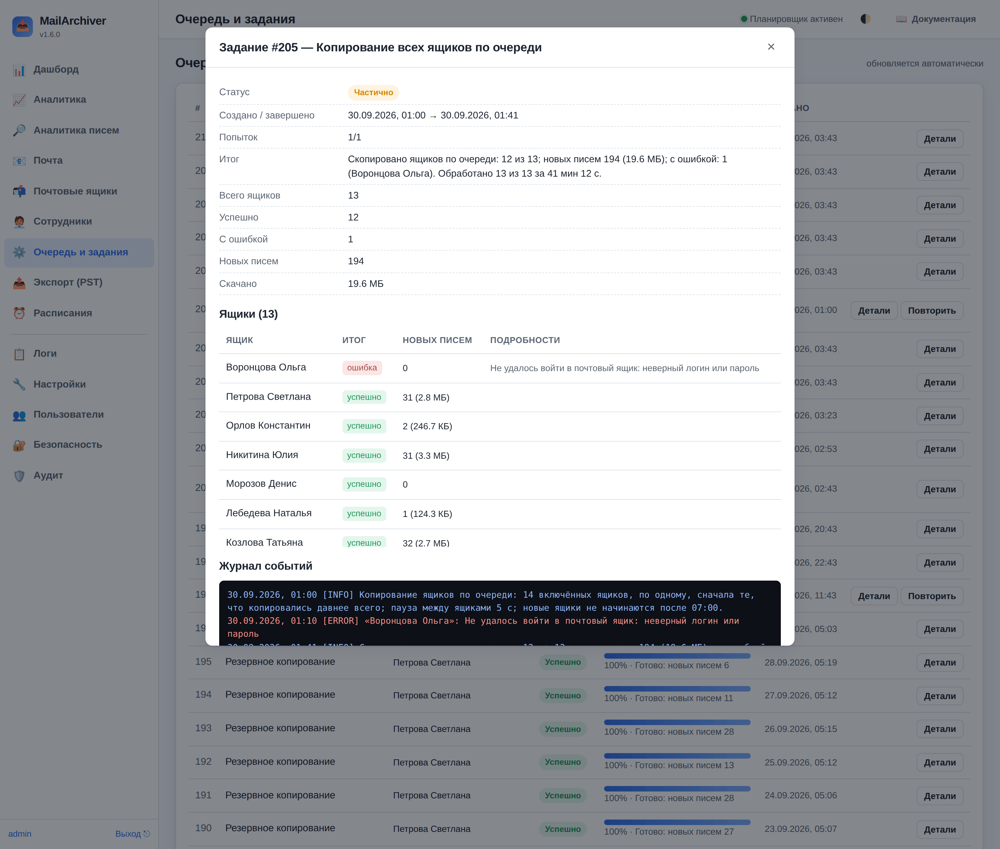

# 18. Расписания и копирование всех ящиков по очереди

Раздел **«Расписания»** запускает задания сам: копирование ящиков, очистку по сроку хранения,
проверку целостности. С версии 1.5.0 в нём есть особое задание — **копирование всех включённых
ящиков по очереди, ящик за ящиком**, в заданное время.

Часовой пояс расписаний — «Настройки → Планировщик → Часовой пояс расписаний»
(`scheduler.timezone`, по умолчанию Europe/Moscow).

## 18.1. Расписание одного ящика

«**+ Добавить расписание**»:

- **Что делать** — резервное копирование ящика, очистка по сроку хранения или проверка целостности
  (или «Копирование ВСЕХ включённых ящиков по очереди», см. 18.2);
- **Ящик**;
- **Тип**: «В определённое время» или «Через интервал» (в минутах).

Для «В определённое время» достаточно выбрать **«Когда»** (каждый день, по будням, по выходным) и
**«Время»** — cron-выражение подставится само. Для особых случаев — «своё cron-выражение» из пяти
полей `минуты часы день месяц день_недели`:

| Выражение | Значение |
|---|---|
| `0 3 * * *` | каждый день в 03:00 |
| `0 */6 * * *` | каждые 6 часов |
| `30 2 * * 1` | по понедельникам в 02:30 |
| `0 22 * * 1-5` | по будням в 22:00 |
| `0 4 * * 0,6` | по выходным в 04:00 |

Дни недели — как в crontab: **1 — понедельник … 6 — суббота, 0 и 7 — воскресенье**; можно и
названиями (`mon-fri`). До версии 1.5.0 числа дней сдвигались на день (подробно — в разделе
«Обновление на 1.5.0» в [03-installation.md](03-installation.md)).

Много ящиков одинаковыми расписаниями удобнее обслуживать групповым действием
«⏰ Назначить расписание копирования» ([17-bulk.md](17-bulk.md)): там же можно **разнести запуск**
сотен ящиков по времени, чтобы они не стартовали в одну минуту.

## 18.2. Копирование всех ящиков по очереди

Кнопка «**🔁 Копирование всех ящиков по очереди**» вверху раздела. В заданное время запускается
**одно задание**, которое копирует все включённые ящики **строго по одному**: следующий ящик
начинается, только когда закончен предыдущий. Сам проход никогда не копирует два ящика сразу —
сколько бы ни было свободных мест в очереди. (Другие копирования — по собственным расписаниям ящиков
или кнопкам — могут идти параллельно с ним, поэтому свои расписания ящиков лучше убрать, см. ниже.)

Настройки:

| Поле | Что задаёт |
|---|---|
| Когда / Время | например, каждый день в 01:00 |
| Пауза между ящиками, секунд | передышка почтовому серверу (0–3600). Выдерживается только после настоящего копирования — пропущенные ящики паузу не ждут |
| Не начинать новые ящики после | например, 07:00 — к началу рабочего дня. Ящик, который копируется в этот момент, докопируется; остальные ждут следующего прохода. Пусто — без ограничения |
| Порядок ящиков | «сначала те, что копировались давнее всего» (по умолчанию) или по алфавиту |

**Порядок «давние первыми»** решает главную задачу: если проход не успел до «не начинать после»
или прервался, следующий начнёт именно с тех ящиков, до которых очередь не дошла, — ни один ящик
не остаётся без копии неделями. «Давность» считается по последней попытке: удачной копии,
проверке входа или неудачному прогону.

**Что проход делает сам:**

- в проход входят только включённые ящики (выключенный уже во время прохода пропускается);
  ящики без пароля (или с паролем, который не расшифровывается) и без адреса сервера пропускаются с
  причиной в итоге;
- пока проход копирует ящик, очередь не запускает по этому ящику других заданий (экспорт,
  восстановление подождут). Ящик, по которому уже идёт своё задание, откладывается в конец прохода;
  если он занят и тогда — пропускается;
- если **сервер не отвечает** на 5 ящиках подряд, остальные его ящики в этом проходе пропускаются
  (чтобы не ждать тайм-аут на каждом) — ящики других серверов копируются дальше. Пропущенные так
  ящики будут первыми в следующий раз. Если из-за недоступного сервера не удалось скопировать ни
  одного ящика, задание повторяется позже (как обычное копирование: «Настройки → Резервное
  копирование → Число повторов»);
- кончилось место на диске — проход останавливается (иначе каждый следующий ящик падал бы с той же
  ошибкой);
- **перезапуск службы** посреди прохода не начинает его заново: после запуска проход продолжается с
  того же места. Отмена задания останавливает проход; следующий начнётся по порядку давности;
- если к следующему запуску по расписанию прежний проход ещё идёт, второй не ставится — прежний
  просто продолжает работу.

**Итог** — в деталях задания («Очередь и задания»): сколько ящиков скопировано, новых писем и объём,
с ошибкой (ящики названы), пропущено и почему, сколько не успели. Ниже — таблица по каждому ящику:
сначала ящики с ошибкой, неполные и пропущенные. В журнале задания — только предупреждения и
ошибки ящиков и строка хода каждые 25 ящиков; подробности каждого ящика — в его «истории»
копирования (колонка «Резервные копии»).

**Письмо об итоге** (если включены уведомления, «Настройки → Уведомления»): в теме — статус и
«N из M, с ошибкой K», в тексте — поимённо ящики с ошибкой (с причиной), скопированные частично
(какие папки не прочитаны), пропущенные (почему), те, до кого не дошла очередь, и ящики с
наибольшим числом новых писем. Утром видно, что делать, не открывая интерфейс. Письмо приходит,
если проход завершился с ошибками или частично («Уведомлять об ошибках»), а при «Уведомлять об
успехе» — и после удачного прохода.

### Не копировать ящики дважды

Если включено копирование всех ящиков по очереди, собственные расписания копирования ящиков
**не нужны**: с ними ящик копируется дважды — по своему расписанию и в проходе. Раздел
«Расписания» предупреждает об этом и предлагает кнопку «**Удалить свои расписания ящиков…**»
(групповое действие «Удалить расписания», с проверкой перед удалением).

Синхронизация сотрудников, пока включён проход по очереди, не заводит новым ящикам собственных
расписаний — они и так попадут в проход (предпросмотр «Сотрудники → 🧩 Шаблон ящиков» так и
пишет: «общее: все ящики по очереди»). «Добавить ящики списком» тоже подсказывает, что своё
расписание не обязательно.

Проход по **выбранным** ящикам («🔁 Копировать по очереди» в групповых действиях или «По очереди»
на панели выбранных ящиков) общему проходу по расписанию не мешает — встанет в очередь следом.

## 18.3. Параллельно или по очереди?

| | Параллельно (свои расписания или «Копия всех» → «Параллельно») | По очереди (один проход) |
|---|---|---|
| Нагрузка на почтовый сервер | до «Одновременных заданий» копирований сразу | проход копирует один ящик за раз |
| Время прохода | быстрее всего | сумма времени всех ящиков |
| Если не успели к утру | копирования продолжаются днём | новые ящики не начинаются после заданного времени |
| Недоступный сервер | каждый ящик ждёт тайм-аут | после 5 ящиков подряд сервер пропускается |
| Место в очереди | по заданию на ящик | одно задание (остальные места свободны для экспорта и т. п.) |

Ночной проход по очереди обычно быстрый: копирование инкрементальное, у большинства ящиков за сутки
лишь несколько новых писем. А вот **первое** копирование сотен ящиков по одному может занять
несколько ночей — его лучше сделать параллельно («💾 Копия всех сейчас» → «Параллельно»), например в
выходные, а потом включить проход по очереди.
